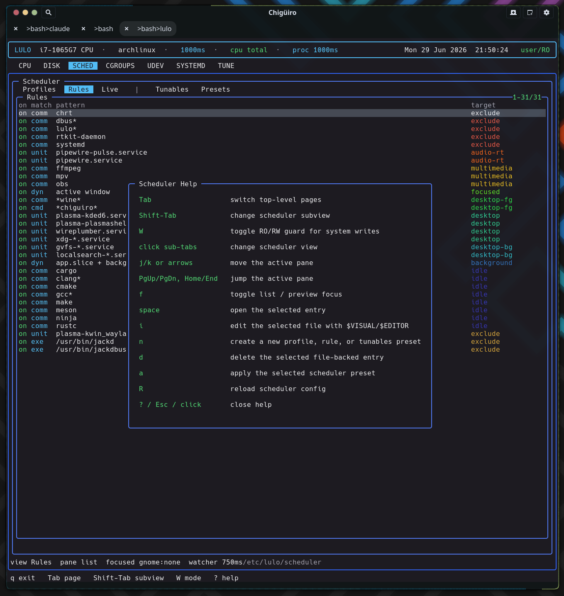

# Lulo -- Architecture Overview

This page is the system map for Lulo: the three processes, the privilege boundary between them, where each subsystem lives, and how a request travels from the TUI down to a privileged write.

## Table of Contents

1. [What Lulo is](#1-what-lulo-is)
2. [Process model](#2-process-model)
3. [Privilege model](#3-privilege-model)
4. [IPC boundaries](#4-ipc-boundaries)
5. [Source layout](#5-source-layout)
6. [Page modules](#6-page-modules)
7. [Design rules](#7-design-rules)
8. [Document index](#8-document-index)

---

## 1. What Lulo is

Lulo is a terminal-based Linux management and observability tool. It renders a Notcurses TUI over a split daemon backend so that live inspection (CPU, processes, disk) and privileged policy work (scheduler enforcement, system-file edits) can share one cohesive interface without the frontend ever running as root.

The project is intentionally a *three-process* design rather than one monolithic privileged binary. The frontend draws and handles input, a session daemon caches state and integrates with the desktop, and a privileged daemon is the only component that writes system files or enforces scheduler policy. Everything below follows from that split.

<svg width="100%" viewBox="0 0 980 660" xmlns="http://www.w3.org/2000/svg">
  

  <rect x="0" y="0" width="980" height="660" class="bg"/>
  <text x="490" y="26" text-anchor="middle" class="title">Lulo process architecture</text>

  <!-- UI layer -->
  <rect x="20" y="46" width="940" height="96" class="layer-u"/>
  <text x="40" y="66" class="lbl-grn">lulo  --  TUI frontend (Notcurses)</text>
  <text x="40" y="80" class="lbl-mut">rendering, input decoding, page orchestration, external-editor handoff</text>

  <rect x="40"  y="92" width="118" height="40" class="box"/>
  <text x="99"  y="110" text-anchor="middle" class="lbl-sm">CPU</text>
  <text x="99"  y="124" text-anchor="middle" class="lbl-mut">proc tree</text>
  <rect x="170" y="92" width="118" height="40" class="box"/>
  <text x="229" y="110" text-anchor="middle" class="lbl-sm">DISK</text>
  <text x="229" y="124" text-anchor="middle" class="lbl-mut">usage</text>
  <rect x="300" y="92" width="118" height="40" class="box"/>
  <text x="359" y="110" text-anchor="middle" class="lbl-sm">SCHED</text>
  <text x="359" y="124" text-anchor="middle" class="lbl-mut">policy</text>
  <rect x="430" y="92" width="118" height="40" class="box"/>
  <text x="489" y="110" text-anchor="middle" class="lbl-sm">CGROUPS</text>
  <text x="489" y="124" text-anchor="middle" class="lbl-mut">hierarchy</text>
  <rect x="560" y="92" width="118" height="40" class="box"/>
  <text x="619" y="110" text-anchor="middle" class="lbl-sm">SYSTEMD</text>
  <text x="619" y="124" text-anchor="middle" class="lbl-mut">units</text>
  <rect x="690" y="92" width="118" height="40" class="box"/>
  <text x="749" y="110" text-anchor="middle" class="lbl-sm">TUNE</text>
  <text x="749" y="124" text-anchor="middle" class="lbl-mut">tunables</text>
  <rect x="820" y="92" width="118" height="40" class="box"/>
  <text x="879" y="110" text-anchor="middle" class="lbl-sm">UDEV</text>
  <text x="879" y="124" text-anchor="middle" class="lbl-mut">rules</text>

  <!-- lulo -> lulod connector -->
  <line x1="300" y1="142" x2="300" y2="196" class="ln"/>
  <text x="312" y="170" class="lbl-cy">user runtime socket</text>
  <text x="312" y="183" class="lbl-mut">snapshots, edit requests, focus state</text>

  <!-- Session layer -->
  <rect x="20" y="200" width="690" height="118" class="layer-s"/>
  <text x="40" y="220" class="lbl-blu">lulod  --  user / session daemon</text>
  <text x="40" y="234" class="lbl-mut">cached state, desktop integration, keeps blocking work off the UI</text>

  <rect x="40"  y="244" width="200" height="62" class="box"/>
  <text x="140" y="262" text-anchor="middle" class="lbl-sm">snapshot caches</text>
  <text x="140" y="276" text-anchor="middle" class="lbl-mut">SCHED / SYSTEMD / TUNE</text>
  <text x="140" y="289" text-anchor="middle" class="lbl-mut">CGROUPS / UDEV</text>

  <rect x="252" y="244" width="200" height="62" class="box"/>
  <text x="352" y="262" text-anchor="middle" class="lbl-sm">focus integration</text>
  <text x="352" y="276" text-anchor="middle" class="lbl-mut">consumes focused PID,</text>
  <text x="352" y="289" text-anchor="middle" class="lbl-mut">forwards to system daemon</text>

  <rect x="464" y="244" width="226" height="62" class="box"/>
  <text x="577" y="262" text-anchor="middle" class="lbl-sm">edit / apply proxy</text>
  <text x="577" y="276" text-anchor="middle" class="lbl-mut">stages file-backed edits,</text>
  <text x="577" y="289" text-anchor="middle" class="lbl-mut">relays privileged operations</text>

  <!-- Focus providers -->
  <rect x="726" y="200" width="234" height="118" class="layer-f"/>
  <text x="746" y="220" class="lbl-cy">focus providers</text>
  <text x="746" y="234" class="lbl-mut">report the focused window PID</text>
  <rect x="746" y="244" width="194" height="28" class="box"/>
  <text x="843" y="262" text-anchor="middle" class="lbl-mut">lulod-focus-kde  (KWin script)</text>
  <rect x="746" y="278" width="194" height="28" class="box"/>
  <text x="843" y="296" text-anchor="middle" class="lbl-mut">lulod-focus-gnome  (Shell ext)</text>
  <line x1="726" y1="275" x2="452" y2="275" class="ln"/>

  <!-- privilege boundary -->
  <line x1="20" y1="338" x2="960" y2="338" class="bound"/>
  <text x="490" y="333" text-anchor="middle" class="lbl-yel">polkit / systemd system service  --  privilege boundary</text>

  <!-- lulod -> lulod-system connector -->
  <line x1="352" y1="318" x2="352" y2="360" class="ln"/>
  <text x="364" y="352" class="lbl-cy">/run socket</text>

  <!-- Privileged layer -->
  <rect x="20" y="362" width="940" height="118" class="layer-p"/>
  <text x="40" y="382" class="lbl-pur">lulod-system  --  privileged system daemon</text>
  <text x="40" y="396" class="lbl-mut">scheduler enforcement, privileged edits, long-lived system policy</text>

  <rect x="40"  y="406" width="280" height="62" class="box-hot"/>
  <text x="180" y="424" text-anchor="middle" class="lbl-yel">scheduler engine</text>
  <text x="180" y="438" text-anchor="middle" class="lbl-mut">loads /etc/lulo config, scans /proc,</text>
  <text x="180" y="451" text-anchor="middle" class="lbl-mut">applies nice / policy / RT / I-O priority</text>

  <rect x="332" y="406" width="280" height="62" class="box"/>
  <text x="472" y="424" text-anchor="middle" class="lbl-sm">privileged edit sessions</text>
  <text x="472" y="438" text-anchor="middle" class="lbl-mut">direct write / delete / commit</text>
  <text x="472" y="451" text-anchor="middle" class="lbl-mut">back to system files</text>

  <rect x="624" y="406" width="316" height="62" class="box"/>
  <text x="782" y="424" text-anchor="middle" class="lbl-sm">system file operations</text>
  <text x="782" y="438" text-anchor="middle" class="lbl-mut">systemd units, cgroup controls,</text>
  <text x="782" y="451" text-anchor="middle" class="lbl-mut">udev rules / hwdb, tune writes</text>

  <!-- system targets -->
  <line x1="180" y1="468" x2="180" y2="516" class="ln"/>
  <line x1="472" y1="468" x2="472" y2="516" class="ln"/>
  <line x1="782" y1="468" x2="782" y2="516" class="ln"/>

  <rect x="40"  y="520" width="170" height="40" class="sys"/>
  <text x="125" y="538" text-anchor="middle" class="lbl-mut">/etc/lulo/scheduler</text>
  <text x="125" y="552" text-anchor="middle" class="lbl-mut">profiles / rules</text>
  <rect x="226" y="520" width="150" height="40" class="sys"/>
  <text x="301" y="538" text-anchor="middle" class="lbl-mut">/proc</text>
  <text x="301" y="552" text-anchor="middle" class="lbl-mut">process scan</text>
  <rect x="392" y="520" width="180" height="40" class="sys"/>
  <text x="482" y="538" text-anchor="middle" class="lbl-mut">/sys + /sys/fs/cgroup</text>
  <text x="482" y="552" text-anchor="middle" class="lbl-mut">tunables / controls</text>
  <rect x="588" y="520" width="170" height="40" class="sys"/>
  <text x="673" y="538" text-anchor="middle" class="lbl-mut">systemd units</text>
  <text x="673" y="552" text-anchor="middle" class="lbl-mut">config / drop-ins</text>
  <rect x="774" y="520" width="166" height="40" class="sys"/>
  <text x="857" y="538" text-anchor="middle" class="lbl-mut">udev rules / hwdb</text>
  <text x="857" y="552" text-anchor="middle" class="lbl-mut">device config</text>

  <!-- admin helper -->
  <rect x="40" y="592" width="920" height="44" class="box"/>
  <text x="60" y="612" class="lbl-cy">lulo-admin</text>
  <text x="60" y="626" class="lbl-mut">narrow privileged helper used by the polkit / pkexec path for one-shot elevated actions</text>
</svg>

## 2. Process model

Lulo runs as three cooperating processes, each with a tightly scoped responsibility. The frontend is the only one a user interacts with directly; the two daemons sit behind sockets.

| Process | Scope | Responsibilities |
| --- | --- | --- |
| `lulo` | UI | Notcurses rendering, input handling, editor handoff, page orchestration |
| `lulod` | User / session | Session-facing cache and state, focus integration, frontend IPC, page snapshots |
| `lulod-system` | Privileged / system | Scheduler enforcement, privileged edit / apply operations, long-lived system policy |

### Related helpers

| Helper | Purpose |
| --- | --- |
| `lulo-admin` | Narrow privileged helper used by the current polkit / pkexec path |
| `lulod-focus-kde` | KDE / Qt focus helper that reports the currently focused window PID |
| `lulod-focus-gnome` | GNOME focus helper; relays the PID published by the `lulod-focus@ninez.org` Shell extension |

The frontend stays small and responsive because anything that blocks -- scanning `/proc`, building a systemd inventory, reading a deep cgroup tree -- happens in `lulod`, not in the render loop. See [Process Model & IPC](process-model-ipc.gen.html) for the request/response detail.

## 3. Privilege model

The defining property of the architecture is that **the TUI never writes system files and never runs as root**. Privilege is concentrated in one place and reached only through a socket.

| Layer | Trust | What it may do |
| --- | --- | --- |
| `lulo` | Unprivileged user | Read public state, render, request edits, hand off to `$EDITOR` |
| `lulod` | Unprivileged user | Cache snapshots, integrate focus, proxy edit/apply requests |
| `lulod-system` | Privileged (system service) | Apply scheduler policy, write/commit system files, mutate cgroup / sysfs / procfs |

A privileged write always crosses the boundary explicitly: the frontend stages an edit, `lulod` relays it, and `lulod-system` performs the write and commits it back. The one-shot `lulo-admin` helper exists for the narrow polkit / pkexec elevation path. This keeps the attack surface of the elevated component small and auditable.

<figure class="screenshot">
  
  <figcaption>The page bar (top) switches Lulo's seven views; here SCHED &rarr; Rules with the help overlay, and the header showing <code>user/RO</code> mode &mdash; the unprivileged default.</figcaption>
</figure>

## 4. IPC boundaries

There are exactly two IPC boundaries, each a Unix socket, each carrying a narrow message set.

| Boundary | Transport | Used for |
| --- | --- | --- |
| `lulo <-> lulod` | Unix socket under the user runtime dir | `SYSTEMD`, `TUNE`, `CGROUPS`, `UDEV`, scheduler snapshots, focus / session-facing state |
| `lulod <-> lulod-system` | Unix socket under `/run` | Scheduler reload / scan state, focus updates, privileged edits, file apply / delete operations |

Shared IPC code lives in one place so both ends stay in sync:

- `src/shared/lulod_ipc.c` -- frontend / session-daemon protocol
- `src/shared/lulod_system_ipc.c` -- session-daemon / system-daemon protocol

## 5. Source layout

| Path | Purpose |
| --- | --- |
| `src/app` | TUI shell, input handling, page rendering, widget drawing, help overlay |
| `src/core` | Shared page models and user-daemon client backends |
| `src/daemon` | `lulod`, `lulod-system`, focus helpers, privileged edit / scheduler code |
| `src/shared` | IPC, proc metadata, and shared helpers |
| `src/admin` | Narrow admin helper entrypoint |
| `include` | Public / internal headers |

The build also supports running directly from the repo checkout for development, so the same layout works installed under `/usr` or in-tree.

## 6. Page modules

Each TUI page pairs an `app`-layer renderer with one or more `core`-layer models and backends. The renderer owns drawing and interaction; the model owns data and refresh.

| Page | App module(s) | Core module(s) | Subviews |
| --- | --- | --- | --- |
| CPU / proc | main app shell | `lulo_model.c`, `lulo_proc.c` | main CPU + proc tree |
| DISK | `lulo_widgets.c` | `lulo_dizk.c` | n/a |
| SCHED | `lulo_sched_page.c` | `lulo_sched.c`, `lulo_sched_backend.c` | `Profiles`, `Rules`, `Live` |
| CGROUPS | `lulo_cgroups_page.c` | `lulo_cgroups.c`, `lulo_cgroups_backend.c` | `Tree`, `Files`, `Config` |
| SYSTEMD | `lulo_systemd_page.c` | `lulo_systemd.c`, `lulo_systemd_backend.c` | `Services`, `Deps`, `Config` |
| UDEV | `lulo_udev_page.c` | `lulo_udev.c`, `lulo_udev_backend.c` | `Rules`, `Hwdb`, `Devices` |
| TUNE | `lulo_tune_page.c` | `lulo_tune.c`, `lulo_tune_backend.c` | `Explore`, `Snapshots`, `Presets` |

This `app` / `core` / `backend` triad is the repeating unit of the frontend. New pages follow the same shape: a renderer, a model, and a backend that talks to `lulod`.

## 7. Design rules

The architecture is held together by a handful of rules. They are the reason the split is worth its overhead.

- Keep rendering and terminal handling in `lulo`.
- Keep session integration and cache orchestration in `lulod`.
- Keep privileged writes and long-lived enforcement in `lulod-system`.
- Prefer visible, editable policy over hidden hardcoded behavior.
- Use file-backed config plus runtime dynamic application, not opaque daemon-only state.
- Never let the TUI write system files directly; always cross the privilege boundary explicitly.

## 8. Document index

| Document | Covers |
| --- | --- |
| [Process Model & IPC](process-model-ipc.gen.html) | The two sockets, message flow, and how a privileged edit travels end to end |
| [Scheduler](scheduler.gen.html) | Profiles, rules, policy resolution, enforcement loop, and focused-app policy |
| [Focus Providers](focus-providers.gen.html) | KDE and GNOME focus detection and the provider contract |
| [CPU & Process View](cpu.gen.html) | CPU sampling and the live process tree |
| [Disk View](disk.gen.html) | Filesystem usage dashboard |
| [Cgroups View](cgroups.gen.html) | Cgroup hierarchy, control files, and related config |
| [Systemd View](systemd.gen.html) | Units, reverse dependencies, and config editing |
| [Tune View](tune.gen.html) | Tunables explorer, snapshots, and presets |
| [Udev View](udev.gen.html) | Rules, hwdb, and live device inspection |
| [Install & Packaging](install.gen.html) | Build, install, services, and packaging flow |
