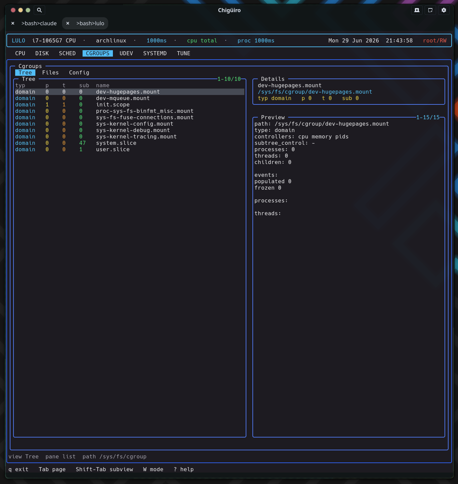

# Lulo -- Cgroups View

The `CGROUPS` page is a live `/sys/fs/cgroup` browser that also knows where each cgroup *comes from*: its three subviews bridge the runtime cgroup hierarchy, the raw controller files, and the static systemd unit definitions that shape those limits -- all by reading the filesystem directly, with no libcgroup or systemd API in the data path.

## Table of Contents

1. [What the page shows](#1-what-the-page-shows)
2. [The three subviews and their sources](#2-the-three-subviews-and-their-sources)
3. [Tree: browsing the live hierarchy](#3-tree-browsing-the-live-hierarchy)
4. [Files: controller state](#4-files-controller-state)
5. [Config: the units behind the limits](#5-config-the-units-behind-the-limits)
6. [Editing and the snapshot model](#6-editing-and-the-snapshot-model)
7. [Why this matters to the scheduler](#7-why-this-matters-to-the-scheduler)
8. [See also](#8-see-also)

---

## 1. What the page shows

`CGROUPS` makes cgroup state and configuration visible without leaving the TUI. The interesting design choice is that it reaches the same subject -- resource control -- from two completely different angles: the live cgroup filesystem on one side, and the systemd unit files that produce those cgroups on the other.

Like the systemd, udev, and tune pages, it runs on the client/daemon split: a worker-thread backend in the frontend talks to `lulod` over a socket, and the frontend only ever consumes cached snapshots (see [Process Model & IPC](process-model-ipc.gen.html)).

## 2. The three subviews and their sources

Each subview reads a distinct part of the system, which is what makes the page more than a directory listing.

<svg width="100%" viewBox="0 0 980 360" xmlns="http://www.w3.org/2000/svg">
  
  <rect x="0" y="0" width="980" height="360" class="bg"/>
  <text x="490" y="26" text-anchor="middle" class="title">CGROUPS: three views, three filesystem sources</text>

  <rect x="40"  y="60" width="270" height="54" class="view"/>
  <text x="175" y="82"  text-anchor="middle" class="lbl-blu">Tree</text>
  <text x="175" y="100" text-anchor="middle" class="lbl-mut">live hierarchy browser</text>
  <rect x="355" y="60" width="270" height="54" class="view"/>
  <text x="490" y="82"  text-anchor="middle" class="lbl-blu">Files</text>
  <text x="490" y="100" text-anchor="middle" class="lbl-mut">controller pseudo-files</text>
  <rect x="670" y="60" width="270" height="54" class="view"/>
  <text x="805" y="82"  text-anchor="middle" class="lbl-blu">Config</text>
  <text x="805" y="100" text-anchor="middle" class="lbl-mut">unit definitions</text>

  <line x1="175" y1="114" x2="175" y2="170" class="ln"/>
  <line x1="490" y1="114" x2="490" y2="170" class="ln"/>
  <line x1="805" y1="114" x2="805" y2="170" class="ln"/>

  <rect x="40"  y="172" width="270" height="50" class="src"/>
  <text x="175" y="194" text-anchor="middle" class="lbl-sm">/sys/fs/cgroup/&lt;path&gt;</text>
  <text x="175" y="210" text-anchor="middle" class="lbl-mut">child dirs, cgroup.type/controllers</text>
  <rect x="355" y="172" width="270" height="50" class="src"/>
  <text x="490" y="194" text-anchor="middle" class="lbl-sm">cgroup control files</text>
  <text x="490" y="210" text-anchor="middle" class="lbl-mut">value + access(W_OK)</text>
  <rect x="670" y="172" width="270" height="50" class="src"/>
  <text x="805" y="194" text-anchor="middle" class="lbl-sm">/etc + /usr/lib systemd dirs</text>
  <text x="805" y="210" text-anchor="middle" class="lbl-mut">.slice / .service / dropins</text>

  <rect x="670" y="250" width="270" height="74" class="note"/>
  <text x="805" y="272" text-anchor="middle" class="lbl-sm">filtered to resource directives</text>
  <text x="805" y="290" text-anchor="middle" class="lbl-mut">CPUQuota= / MemoryMax= / IOWeight= ...</text>
  <text x="805" y="304" text-anchor="middle" class="lbl-mut">38-entry directive table</text>
  <text x="805" y="318" text-anchor="middle" class="lbl-mut">only units that actually set a limit</text>
  <line x1="805" y1="222" x2="805" y2="250" class="ln"/>
</svg>

## 3. Tree: browsing the live hierarchy

The Tree view is a real directory browser over `/sys/fs/cgroup`, walked with `opendir` / `readdir` / `lstat` -- there is no libcgroup dependency. For the current browse path it lists child cgroups and reads each one's pseudo-files: `cgroup.type`, `cgroup.controllers`, and line counts of `cgroup.procs` and `cgroup.threads` for the process and thread tallies. The child-directory count becomes the `sub` column.

| Column | Meaning |
| --- | --- |
| `typ` | `cgroup.type` (domain / threaded / ...) |
| `p` | Process count (lines in `cgroup.procs`) |
| `t` | Thread count (lines in `cgroup.threads`) |
| `sub` | Number of child cgroups |
| `name` | Cgroup directory name |

When you are not at the root, a synthetic `..` row is prepended so you can navigate up; parent rows sort first and render in a distinct color. Opening a directory descends into it and triggers a full re-gather for the new path. The browse path is sanitized with `realpath` and rejected if it would escape `/sys/fs/cgroup`, so the browser can never wander outside the hierarchy.

The Tree preview pane is the richest part: it shows the path, type, controllers, `subtree_control`, and counts, then `cgroup.events`, then up to a dozen each of the member processes and threads -- with their PIDs/TIDs resolved to command names via the shared proc-metadata reader.

<figure class="screenshot">
  
  <figcaption>The Tree view browsing the live cgroup hierarchy; selecting a cgroup previews its type, controllers, events, and member processes.</figcaption>
</figure>

## 4. Files: controller state

The Files view drops from "which cgroup" to "what is this cgroup configured to do." It lists the regular files in the selected cgroup directory -- the controller interface files -- reading each file's first line as its current value and probing `access(W_OK)` to mark whether it is writable.

| Column | Meaning |
| --- | --- |
| `rw` | Writable (green) vs read-only (dim) |
| `name` | Control file name (e.g. `cpu.max`, `memory.high`) |
| `value/path` | Current value, or path |

Selecting a file previews its access mode, current value, and a raw dump of the file (capped to keep the snapshot bounded). This is where you confirm the live, effective value of a controller -- as opposed to the Config view, which shows what *should* set it.

## 5. Config: the units behind the limits

The Config view does not read cgroupfs at all. It scans the systemd unit directories (eight roots under `/etc/systemd/*` and `/usr/lib/systemd/*` plus `/lib`), recursively, and includes a file only if it is a `.slice`, or a `.service` / `.scope` / drop-in `.conf` that **actually contains a cgroup resource directive**.

That filter is the clever bit: rather than dumping every unit, it matches file contents against a 38-entry table of resource-control directives -- `CPUQuota=`, `MemoryMax=`, `IOWeight=`, and the rest -- so the Config list is exactly the set of units that impose a cgroup limit. Sources are ranked and colored (`/etc` overrides green, vendor `/usr/lib` cyan), and the kind column distinguishes slice / service / scope / dropin / conf. Selecting one previews the unit file.

So the page answers two different questions with two different data paths: *Tree/Files* = "what is the kernel doing right now," *Config* = "which unit declared that limit, and where do I edit it."

## 6. Editing and the snapshot model

There is no inline editing on this page. The Files and Config rows expose a path through the shared external-editor handoff: pressing `i` collects the active edit path, suspends the TUI, runs `$VISUAL` / `$EDITOR` on it, and resumes. The Tree view is not editable (it is a navigator). Writes that target privileged paths go through `lulod-system`'s atomic, allowlist-scoped edit protocol; cgroup pseudo-files are written in place rather than via rename, because atomic rename is not meaningful for kernel interface files.

The snapshot the daemon caches holds the tree rows, file rows, configs, and the active preview lines, plus the current browse path. The config scan runs once and is cached (`configs_loaded`); the daemon re-gathers the tree when the TTL expires or the browse path changes, and re-renders just the preview when the selection moves.

## 7. Why this matters to the scheduler

`CGROUPS` is the map that the [scheduler](scheduler.gen.html) reads against. Scheduler rules can match on cgroup path, systemd slice, and unit -- so understanding the shape of the cgroup tree here tells you what those matchers will see. The Tree view shows where a workload actually lives; the Config view shows the slices and services that define it; and the scheduler uses exactly those concepts to decide how a process should be prioritized.

## 8. See also

- [Scheduler](scheduler.gen.html) -- cgroup / slice / unit matchers
- [Systemd View](systemd.gen.html) -- the units whose definitions appear in Config
- [Tune View](tune.gen.html) -- editing `/sys/fs/cgroup` controllers as bundles
- [Architecture Overview](architecture.gen.html)
