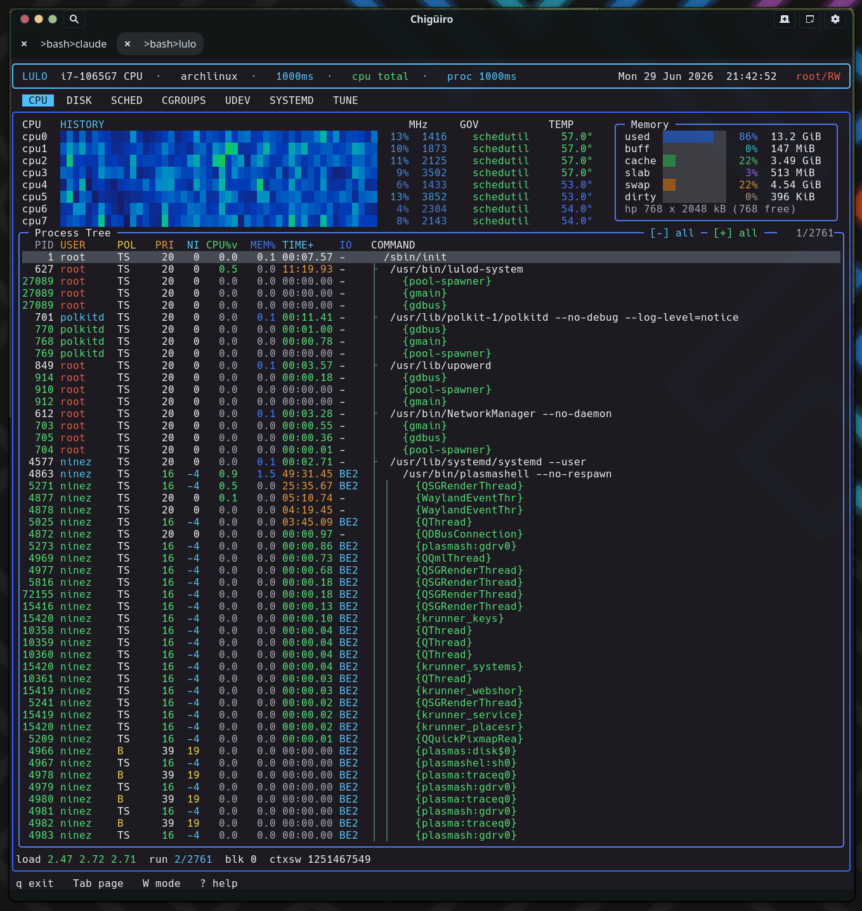

# Lulo -- CPU & Process View

The `CPU` page is Lulo's main runtime observability surface: a per-core CPU history heatmap above a live `/proc`-derived process tree, both sampled on the frontend thread but on deliberately decoupled cadences so the tree can refresh slowly while the heatmap stays smooth.

## Table of Contents

1. [What the page shows](#1-what-the-page-shows)
2. [The two-tier sampling loop](#2-the-two-tier-sampling-loop)
3. [CPU history heatmap](#3-cpu-history-heatmap)
4. [Frequency, governor, and temperature](#4-frequency-governor-and-temperature)
5. [The process tree](#5-the-process-tree)
6. [CPU% modes: total vs per-core](#6-cpu-modes-total-vs-per-core)
7. [Process actions and tracing](#7-process-actions-and-tracing)
8. [Render economy](#8-render-economy)
9. [See also](#9-see-also)

---

## 1. What the page shows

The `CPU` page combines machine-level CPU monitoring with a process-centric inspection tree. It is the one heavy page whose data is gathered directly on the frontend thread rather than in a daemon, which makes its sampling design the most interesting part of the frontend.

| Region | Source | What it shows |
| --- | --- | --- |
| CPU heatmap | `/proc/stat` (`lulo_read_cpu_stat`) | Per-core load history as a scrolling color band |
| CPU metadata | `/sys/.../cpufreq`, hwmon / thermal | Current MHz, governor, and per-core temperature |
| Memory widget | `/proc/meminfo` | Used / buff / cache / slab / swap / dirty / hugepages |
| Process tree | `/proc/[pid]` + `/proc/[pid]/task` | Parent/child process and thread tree with scheduler state |

## 2. The two-tier sampling loop

The frontend (`src/app/lulo.c`) does not run one flat event loop. It runs an outer *sampling* loop wrapped around an inner *event* loop, and the split is what keeps the UI live while bounding how often expensive work runs.

The outer loop fires every `sample_ms` (default 1000ms, adjustable with `+` / `-`). On each tick it polls all six daemon backends, gathers per-page data, and does a full page render. It then enters the inner loop with a deadline of `now + sample_ms`. The inner loop waits on input but the wait is clamped to **at most 100ms**, so even with nothing happening the UI wakes ten times a second to repaint live data and re-check the terminal size. When the deadline expires, control breaks back to the outer loop for the next sample.

<svg width="100%" viewBox="0 0 980 470" xmlns="http://www.w3.org/2000/svg">
  
  <rect x="0" y="0" width="980" height="470" class="bg"/>
  <text x="490" y="26" text-anchor="middle" class="title">CPU page sampling pipeline (decoupled cadences)</text>

  <!-- CPU lane -->
  <text x="40" y="64" class="lbl-blu">CPU cadence  --  every sample_ms (default 1s, +/-)</text>
  <rect x="40"  y="76" width="150" height="48" class="box"/>
  <text x="115" y="96"  text-anchor="middle" class="lbl-sm">/proc/stat</text>
  <text x="115" y="110" text-anchor="middle" class="lbl-mut">per-cpu ticks</text>
  <rect x="230" y="76" width="170" height="48" class="box-cpu"/>
  <text x="315" y="96"  text-anchor="middle" class="lbl-sm">heat % per core</text>
  <text x="315" y="110" text-anchor="middle" class="lbl-mut">work / total delta</text>
  <rect x="440" y="76" width="190" height="48" class="box-cpu"/>
  <text x="535" y="96"  text-anchor="middle" class="lbl-sm">timeline ring [128]</text>
  <text x="535" y="110" text-anchor="middle" class="lbl-mut">shift-left, append right</text>
  <rect x="670" y="76" width="270" height="48" class="box-cpu"/>
  <text x="805" y="96"  text-anchor="middle" class="lbl-sm">heatmap render</text>
  <text x="805" y="110" text-anchor="middle" class="lbl-mut">10-stop gradient per column</text>
  <line x1="190" y1="100" x2="230" y2="100" class="ln"/>
  <line x1="400" y1="100" x2="440" y2="100" class="ln"/>
  <line x1="630" y1="100" x2="670" y2="100" class="ln"/>

  <!-- bridge -->
  <rect x="230" y="160" width="400" height="56" class="box-hot"/>
  <text x="430" y="182" text-anchor="middle" class="lbl-yel">CPU-delta accumulator</text>
  <text x="430" y="198" text-anchor="middle" class="lbl-mut">sums total jiffy delta across skipped samples,</text>
  <text x="430" y="210" text-anchor="middle" class="lbl-mut">used as the denominator for process CPU%</text>
  <line x1="430" y1="124" x2="430" y2="160" class="ln-y"/>
  <line x1="430" y1="216" x2="430" y2="252" class="ln-y"/>

  <!-- proc lane -->
  <text x="40" y="288" class="lbl-grn">proc cadence  --  max(sample_ms, proc_refresh_ms)  (r cycles 1/2/3/5s)</text>
  <rect x="40"  y="300" width="170" height="48" class="box"/>
  <text x="125" y="320" text-anchor="middle" class="lbl-sm">/proc/[pid] walk</text>
  <text x="125" y="334" text-anchor="middle" class="lbl-mut">stat, cmdline, io</text>
  <rect x="250" y="300" width="180" height="48" class="box-proc"/>
  <text x="340" y="320" text-anchor="middle" class="lbl-sm">arena tree build</text>
  <text x="340" y="334" text-anchor="middle" class="lbl-mut">sort + bsearch parents</text>
  <rect x="470" y="300" width="180" height="48" class="box-proc"/>
  <text x="560" y="320" text-anchor="middle" class="lbl-sm">view sync</text>
  <text x="560" y="334" text-anchor="middle" class="lbl-mut">re-locate selected pid</text>
  <rect x="690" y="300" width="250" height="48" class="box-proc"/>
  <text x="815" y="320" text-anchor="middle" class="lbl-sm">three-tier repaint</text>
  <text x="815" y="334" text-anchor="middle" class="lbl-mut">full / body / cursor-only</text>
  <line x1="210" y1="324" x2="250" y2="324" class="ln"/>
  <line x1="430" y1="324" x2="470" y2="324" class="ln"/>
  <line x1="650" y1="324" x2="690" y2="324" class="ln"/>

  <text x="40" y="400" class="lbl-mut">Both lanes run on the frontend thread within one outer sample. The inner event</text>
  <text x="40" y="414" class="lbl-mut">loop still wakes every 100ms to repaint live data without resampling /proc.</text>
</svg>

## 3. CPU history heatmap

The heatmap is the band of colored cells at the top of the page: one column per sample, one row per CPU, scrolling right to left.

Each sample reads `/proc/stat` into a `CpuTick` (user / nice / sys / idle / iowait / irq / softirq / steal) for the aggregate `cpu` line and every `cpuN`. Two different percentages are derived on purpose:

| Quantity | Formula | Used for |
| --- | --- | --- |
| Busy % | `(Δtotal − Δ(idle+iowait)) / Δtotal` | The numeric `NN%` column (treats iowait as idle) |
| Heat % | `Δ(user+nice+sys+irq+softirq+steal) / Δtotal` | The heatmap color (excludes iowait from "work") |

Heat values feed a 128-slot per-core ring (`timeline`), appended with a shift-left `memmove` so the newest sample is always at the right edge. Even when you are on another page, the loop keeps appending heat samples, so the history graph is already populated the moment you tab back to `CPU`. Each cell is drawn as a full block colored through a 10-stop interpolated gradient (blue → cyan → green → yellow → orange → red); zero-load cells are left as background so idle cores read as empty rather than dark-blue.

## 4. Frequency, governor, and temperature

CPU metadata is gathered only while the `CPU` page is active, to avoid paying for `/sys` reads you cannot see.

- **Frequency** comes from `cpufreq/scaling_cur_freq` (plus min/max, governor, and driver).
- **Temperature** prefers hwmon `coretemp/tempN_input`, falling back to a `thermal_zone*` whose type matches `x86_pkg`/`pkg`. Logical CPUs are mapped to a physical-core reading via `threads_per_core`, so SMT siblings share one temperature.

The governor and temperature columns are responsive: the governor appears only when the CPU panel is at least 50 columns wide, the temperature only at 58+. Temperature is color-graded (≥75 red, ≥65 orange, ≥55 green, else blue).

## 5. The process tree

The lower half of the page is a live process and thread tree built fresh from `/proc` on each proc-cadence tick.

`gather_processes` iterates `/proc/[pid]`, parsing `/proc/PID/stat` (carefully handling the parenthesized `comm` field) for ppid, utime/stime, priority, nice, thread count, RSS, RT priority, and scheduling policy. Command labels join `/proc/PID/cmdline` (NULs become spaces), falling back to `[comm]` for kernel threads. I/O priority is read with the `ioprio_get` syscall. UID→name lookups go through a small FIFO cache. Threads are only expanded (shown as `{comm}` rows) for processes that actually have more than one thread.

The tree itself is built in an **arena**, not with heap-linked nodes: nodes are sorted by `(pid, is_thread)`, a separate sorted array of process leaders is built, and each node `bsearch`es its parent (threads parent to their `tgid`, processes to their `parent_pid`) and links through `first_child` / `next_sibling` index pointers. That is an O(n log n) build over flat arrays with no per-node allocation.

### Visible fields

| Field | Meaning |
| --- | --- |
| PID | Process id (threads target the `tgid` for actions) |
| user | Owning user (root rendered red) |
| policy | Scheduling policy (`TS`, `FF`, `RR`, `B`, `IDL`, `DLN`, `EXT`) |
| priority / nice | Current scheduling priority |
| CPU | CPU usage in the active percentage mode |
| memory | Resident memory |
| time | Accumulated CPU time (switches to `HhMMm` past 100 minutes) |
| I/O | Linux I/O priority (RT > best-effort > idle) |
| command | Full command line, horizontally pannable |

Long command lines can be panned left/right (arrow keys, 4 columns per step) while the tree prefix stays fixed, so deep argument lists stay inspectable without breaking the tree shape. Selection is keyed by `(pid, is_thread)` rather than row index, so after each rebuild the cursor re-locates the same process instead of jumping when the tree reorders. Sibling sort follows the active column (default CPU descending, with CPU → MEM → TIME → PID tie-breaks); clicking a column header toggles its sort.

<figure class="screenshot">
  
  <figcaption>The CPU history heatmap over the live process tree, with policy, nice, CPU%, memory, and I/O columns.</figcaption>
</figure>

## 6. CPU% modes: total vs per-core

The `p` key toggles how the process CPU% column is normalized. This affects the **process column only** — the per-core heatmap is unchanged.

| Mode | Meaning |
| --- | --- |
| `total` | Default; percent of total machine CPU capacity |
| `per-core` | htop-style; a process pegging one core reads ~100% |

Internally the column is `Δticks × scale × 1000 / cpu_total_delta`, where `scale` is `1.0` in total mode and `logical_cpus` in per-core mode. Because the process tree can refresh more slowly than the CPU samples, the denominator is the **accumulated** total-jiffy delta across every CPU sample since the last proc gather — so process CPU% stays correct even when the tree refreshes every 5s while CPU samples every 1s. Switching modes invalidates the cached snapshot and forces an immediate resnapshot.

## 7. Process actions and tracing

The page is deliberately conservative about privileged inspection, but it does expose direct control over the selected process.

| Action | Key | Effect |
| --- | --- | --- |
| Signal (terminate) | `x` | `SIGTERM` (targets the `tgid` for thread rows) |
| Signal (kill) | `X` | `SIGKILL` |
| Trace | `s` | Start/stop an strace session on the selected process |
| Collapse / expand all | `c` / `e` | Fold the tree to process leaders, or expand fully |
| Refresh cadence | `r` | Cycle the proc refresh interval (1 / 2 / 3 / 5s) |

Tracing requires RW mode (see [Process Model & IPC](process-model-ipc.gen.html)) and refuses kernel threads. When active, the process panel is replaced by a live trace view that tails the most recent output (last 256 KiB) with vertical and horizontal scroll, auto-refreshing on the 100ms idle tick.

## 8. Render economy

Cursor movement does not redraw the whole table. The frontend keeps three repaint tiers and picks the cheapest one each time:

| Tier | Redraws | When |
| --- | --- | --- |
| Full | Entire process panel | New snapshot or layout change |
| Body-only | Rows + count | Scroll position changed |
| Cursor-only | Just the old and new selected rows | Selection moved without scrolling |

Scrolling has streak-based acceleration (consecutive same-direction moves within 120ms step by 2, then 3 units), while mouse-wheel steps stay at 1 unit. Heavy pages elsewhere only repaint when their daemon's snapshot generation advances or a status field changes, so idle daemons cost zero frames.

## 9. See also

- [Architecture Overview](architecture.gen.html)
- [Process Model & IPC](process-model-ipc.gen.html)
- [Scheduler](scheduler.gen.html) -- why a process is being treated the way it is
- [Disk View](disk.gen.html)
