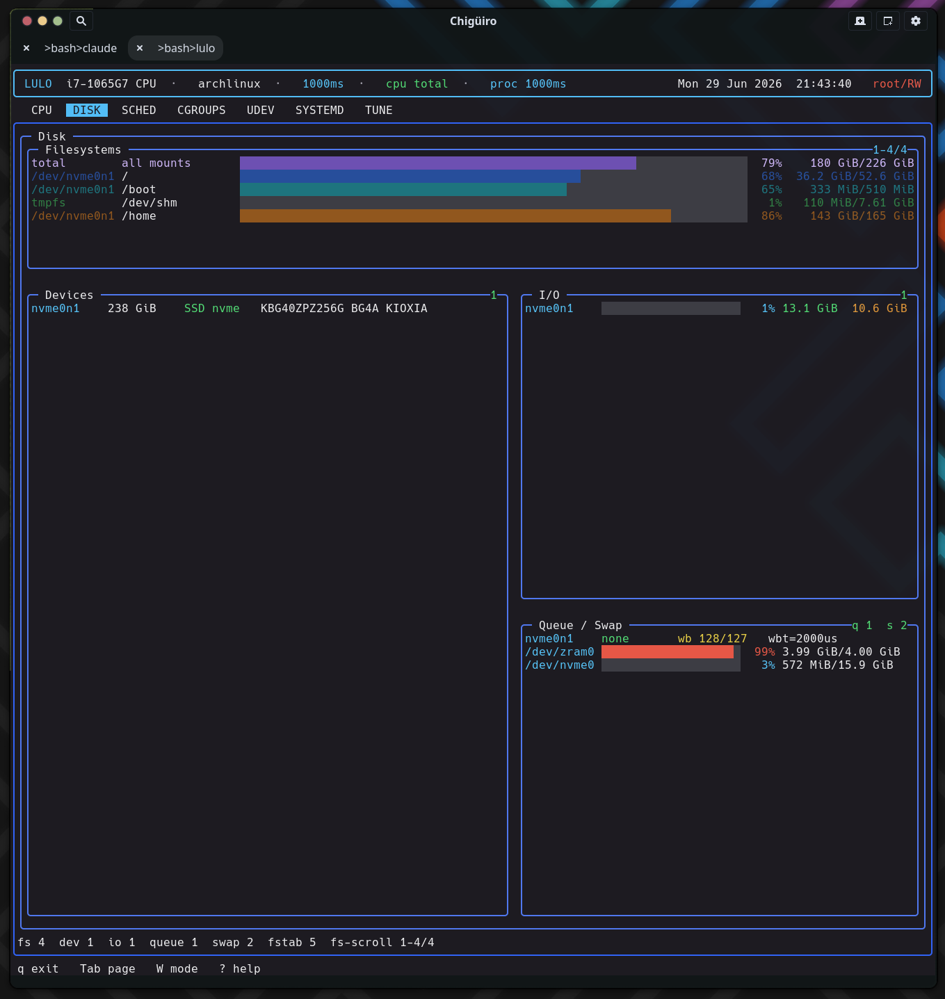

# Lulo -- Disk View

The `DISK` page is the one heavy page with no daemon behind it: it gathers everything synchronously in-process from `/proc`, `/sys/block`, and the mount tables, then lays it out as a responsive multi-panel dashboard covering filesystems, block devices, live I/O, and queue tunables.

## Table of Contents

1. [What the page shows](#1-what-the-page-shows)
2. [Where the data comes from](#2-where-the-data-comes-from)
3. [The responsive panel layout](#3-the-responsive-panel-layout)
4. [Filesystems panel](#4-filesystems-panel)
5. [Devices, I/O, and queue panels](#5-devices-io-and-queue-panels)
6. [Why DISK has no daemon](#6-why-disk-has-no-daemon)
7. [See also](#7-see-also)

---

## 1. What the page shows

`DISK` is a read-only storage dashboard. Unlike the cgroups, systemd, udev, and tune pages -- which each talk to `lulod` over a socket -- the disk page calls one synchronous gather (`lulo_dizk_snapshot_gather`) directly on the frontend thread and renders the result into a set of stacked panels.

| Panel | Source | What it shows |
| --- | --- | --- |
| Filesystems | `getmntent` + `statvfs` | Mounted filesystem usage with an aggregate total row |
| Devices | `/sys/block` | Block devices: size, rotational, model, transport |
| I/O | `/proc/diskstats` + `/proc/uptime` | Per-device utilization and read/write bytes |
| Queue & Swap | `/sys/block/*/queue/*`, `/proc/swaps` | Scheduler, read-ahead, request depth, swap usage |

## 2. Where the data comes from

Every field is parsed from a kernel-provided file or pseudo-file; there is no `df`, `lsblk`, or `iostat` subprocess. The whole snapshot is a flat struct of fixed-size arrays, so the gather does no heap allocation.

<svg width="100%" viewBox="0 0 980 380" xmlns="http://www.w3.org/2000/svg">
  
  <rect x="0" y="0" width="980" height="380" class="bg"/>
  <text x="490" y="26" text-anchor="middle" class="title">DISK snapshot: kernel sources into one synchronous gather</text>

  <rect x="30"  y="56" width="180" height="34" class="src"/>
  <text x="120" y="77" text-anchor="middle" class="lbl-mut">/etc/mtab -> /proc/mounts + statvfs</text>
  <rect x="30"  y="98" width="180" height="34" class="src"/>
  <text x="120" y="119" text-anchor="middle" class="lbl-mut">/sys/block (size, rotational)</text>
  <rect x="30"  y="140" width="180" height="34" class="src"/>
  <text x="120" y="161" text-anchor="middle" class="lbl-mut">/proc/diskstats + /proc/uptime</text>
  <rect x="30"  y="182" width="180" height="34" class="src"/>
  <text x="120" y="203" text-anchor="middle" class="lbl-mut">/sys/block/*/queue/*</text>
  <rect x="30"  y="224" width="180" height="34" class="src"/>
  <text x="120" y="245" text-anchor="middle" class="lbl-mut">/proc/swaps</text>
  <rect x="30"  y="266" width="180" height="34" class="src"/>
  <text x="120" y="287" text-anchor="middle" class="lbl-mut">/etc/fstab + /dev/disk/by-*</text>

  <rect x="360" y="150" width="240" height="70" class="mid"/>
  <text x="480" y="178" text-anchor="middle" class="lbl-grn">lulo_dizk_snapshot_gather</text>
  <text x="480" y="196" text-anchor="middle" class="lbl-mut">in-process, synchronous,</text>
  <text x="480" y="208" text-anchor="middle" class="lbl-mut">fixed arrays, no heap</text>

  <line x1="210" y1="73"  x2="360" y2="170" class="ln"/>
  <line x1="210" y1="115" x2="360" y2="178" class="ln"/>
  <line x1="210" y1="157" x2="360" y2="185" class="ln"/>
  <line x1="210" y1="199" x2="360" y2="192" class="ln"/>
  <line x1="210" y1="241" x2="360" y2="199" class="ln"/>
  <line x1="210" y1="283" x2="360" y2="206" class="ln"/>

  <rect x="740" y="70"  width="210" height="40" class="panel"/>
  <text x="845" y="94"  text-anchor="middle" class="lbl-sm">Filesystems  (+ total row)</text>
  <rect x="740" y="120" width="210" height="40" class="panel"/>
  <text x="845" y="144" text-anchor="middle" class="lbl-sm">Devices</text>
  <rect x="740" y="170" width="210" height="40" class="panel"/>
  <text x="845" y="194" text-anchor="middle" class="lbl-sm">I/O  (util% + rd/wr)</text>
  <rect x="740" y="220" width="210" height="40" class="panel"/>
  <text x="845" y="244" text-anchor="middle" class="lbl-sm">Queue & Swap</text>
  <line x1="600" y1="185" x2="740" y2="90"  class="ln"/>
  <line x1="600" y1="185" x2="740" y2="140" class="ln"/>
  <line x1="600" y1="185" x2="740" y2="190" class="ln"/>
  <line x1="600" y1="185" x2="740" y2="240" class="ln"/>
</svg>

The gather is selective about what it shows so the dashboard stays meaningful:

- **Filesystems** iterate `getmntent` over `/etc/mtab` (falling back to `/proc/mounts`), with a blocklist of pseudo/virtual filesystem types and a dedup by device. `tmpfs` is kept only for `/tmp` and `/dev/shm`. Usage is `total − f_bfree×f_frsize` from `statvfs`.
- **Block devices** come from `/sys/block`, reading `size`, `queue/rotational`, and `device/model`; transport (nvme / sata / mmc / virtio) is inferred from the device name. Loop, ram, dm, and zram devices are skipped.
- **I/O** parses `/proc/diskstats` against `/proc/uptime`, deriving utilization as `io_ms / uptime_ms × 100`; partitions are filtered out so only whole devices show.
- **Queue tunables** read per-disk `/sys/block/*/queue/*` -- the active scheduler (the bracketed `[mq-deadline]` token), `read_ahead_kb`, `nr_requests`, `max_sectors_kb`, `write_cache`, and `wbt_lat_usec`, plus NVMe `power_state` and NUMA node.
- **Swap** parses `/proc/swaps`, and **fstab** is read with `getmntent` over `/etc/fstab`, resolving `UUID=` / `LABEL=` / `PARTLABEL=` entries through the `/dev/disk/by-*` symlink trees.

## 3. The responsive panel layout

The renderer (`build_disk_widget_layout`) is a responsive splitter rather than a fixed grid. The Filesystems panel is always on top; the Devices, I/O, and Queue & Swap panels arrange side by side when the terminal is at least 96 columns wide and stack vertically below that, with per-breakpoint reserved heights and clamped sizing.

<figure class="screenshot">
  
  <figcaption>The DISK dashboard: aggregate total row atop per-filesystem bars, with device, I/O, and queue panels alongside.</figcaption>
</figure>

## 4. Filesystems panel

The Filesystems panel leads with a synthetic **total / "all mounts"** row that sums used and total bytes across every mount and draws an aggregate usage meter. That row uses its own dedicated purple/lavender color so it reads as a summary, not as one of the component mounts.

Each per-filesystem row gets a **stable color keyed to its index, not its usage**: the row index is cycled through a fixed palette permutation into the theme's fill slots, so adjacent filesystems always get distinct hues and a given mount keeps the same color across frames regardless of how full it is. This is a deliberate choice -- the color encodes *identity* (which mount), while the bar length and percentage encode *capacity*.

## 5. Devices, I/O, and queue panels

| Panel | Columns / content |
| --- | --- |
| Devices | Device name, size, rotational/SSD, transport, model |
| I/O | Utilization% bar, read bytes, write bytes (from `diskstats` deltas) |
| Queue & Swap | I/O scheduler, read-ahead, `nr_requests`, plus swap usage meters |

I/O utilization and swap meters are threshold-colored (graded at 25 / 50 / 75 / 90%), so a saturated device or near-full swap is visible at a glance.

## 6. Why DISK has no daemon

Every other heavy page caches its data in `lulod` and serves it to the TUI over a socket, because gathering it (a full systemd unit inventory, a deep cgroup walk) is expensive and must stay off the UI thread. Disk data is cheap -- a handful of small `/proc` and `/sys` reads plus `statvfs` per mount -- so it is gathered inline whenever the page renders or a refresh is requested. There is no TTL cache and no IPC: the snapshot is simply rebuilt each time. This keeps the disk page self-contained and is the reason it is structurally the simplest page in the app.

## 7. See also

- [Architecture Overview](architecture.gen.html)
- [CPU & Process View](cpu.gen.html)
- [Tune View](tune.gen.html) -- editing `/sys/block/*/queue` tunables as bundles
- [Cgroups View](cgroups.gen.html)
