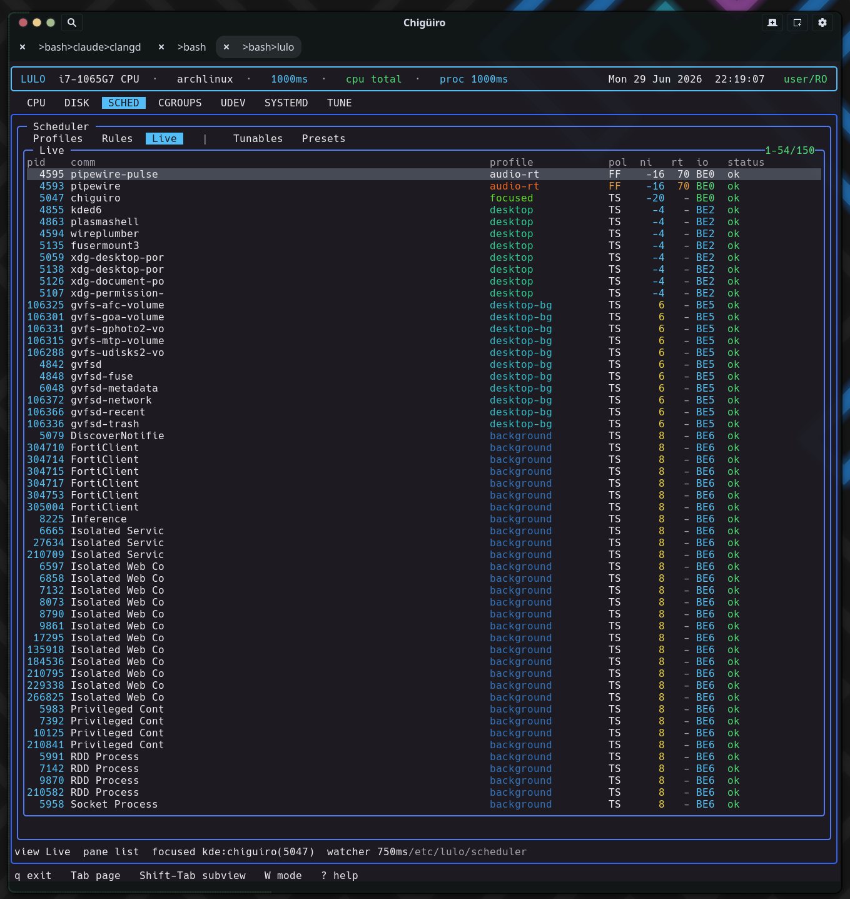

# Lulo -- Focus Providers

Focus detection is how the scheduler learns which window is active so it can boost that app. Lulo treats it as an *external helper subprocess speaking a one-PID-per-line protocol* -- a deliberately desktop-agnostic design that supports KDE and GNOME today through the same session-bus contract, with the data flowing in opposite directions on each.

## Table of Contents

1. [The provider contract](#1-the-provider-contract)
2. [Selection and auto-detection](#2-selection-and-auto-detection)
3. [The KDE provider](#3-the-kde-provider)
4. [The GNOME provider](#4-the-gnome-provider)
5. [Why the two differ](#5-why-the-two-differ)
6. [End-to-end focus flow](#6-end-to-end-focus-flow)
7. [Resilience and fail-safe](#7-resilience-and-fail-safe)
8. [Security considerations](#8-security-considerations)
9. [Adding a provider](#9-adding-a-provider)
10. [See also](#10-see-also)

---

## 1. The provider contract

The core never links a compositor SDK. `lulod` runs a focus *monitor* that forks a provider helper binary and reads its stdout; the entire contract is: **the helper prints one decimal PID per line**, where each line is the PID that currently owns window focus (and `0` means "nothing focused"). The monitor holds the helper's read fd, child PID, a restart timer, a line-assembly buffer, and the last reported `(pid, start_time)` for de-duplication.

That single design decision -- a process boundary plus a line protocol instead of a C interface -- is what keeps the scheduler core desktop-agnostic. The KDE and GNOME specifics live entirely in separate helper binaries (and a KWin script / Shell extension); `lulod` just reads integers.

## 2. Selection and auto-detection

The provider is chosen by `focus_provider_from_env`, which first honors the `LULOD_FOCUS_PROVIDER` override and otherwise auto-detects from the session.

| `LULOD_FOCUS_PROVIDER` | Result |
| --- | --- |
| `none` | Focus tracking disabled |
| `kde` | Force the KDE provider |
| `gnome` | Force the GNOME provider |
| `auto` (or unset) | Auto-detect |
| anything else | Disabled (an unrecognized value turns focus off) |

Once past the override, detection runs in a deliberate order so it keys off what is *actually running* rather than a cached label:

1. **Wayland gate.** If the session is not Wayland (`XDG_SESSION_TYPE != "wayland"` and no `WAYLAND_DISPLAY`), detection returns no provider -- on a pure X11 session focus tracking is off by default, because no X11 helper is implemented.
2. **Live session-bus probe.** `lulod` asks the session bus which compositor owns its well-known name (`NameHasOwner` on `org.kde.KWin` selects KDE, `org.gnome.Shell` selects GNOME). This is authoritative about the compositor that is up *right now*.
3. **Environment fallback.** Only if the bus probe is inconclusive (e.g. the bus is unreachable) does it scan `XDG_CURRENT_DESKTOP`, `XDG_SESSION_DESKTOP`, `DESKTOP_SESSION`, `KDE_FULL_SESSION`, and `KDE_SESSION_VERSION` case-insensitively: a `kde`/`plasma` hit selects KDE, a `gnome` hit selects GNOME.

> **Why probe the bus?** The environment `lulod` sees is a *snapshot*: the user-service installer freezes session variables into a systemd drop-in at install time. After a GNOME&harr;KDE reboot that snapshot is stale, and an env-only detector would launch the wrong helper -- e.g. the GNOME helper on a Plasma session, which finds no `org.ninez.LulodFocus` owner and reports no focus. Probing the live bus self-corrects across desktop switches. For the probe to take effect the installer bakes `LULOD_FOCUS_PROVIDER=auto`, deferring the choice to runtime; an explicit `kde` / `gnome` / `none` still wins.

The helper binary is resolved across several install layouts in order -- next to the running `lulod` (dev checkout), `<prefix>/libexec/lulo/`, the compile-time `LULO_HELPERDIR`, then `/usr/libexec/lulo/` -- so the same daemon works in-tree or installed. If the binary cannot be found the monitor disables itself permanently; if a spawn fails it retries after 5 seconds.

## 3. The KDE provider

The KDE helper `lulod-focus-kde` is a Qt program that bridges KWin's scripting engine to the line protocol. On startup it:

1. **Registers a session-bus service** `org.ninez.LulodFocus` at object path `/LulodFocus`, exporting a single method `UpdateFocusedPid(int)`.
2. **Injects a KWin script at runtime** by calling KWin's scripting D-Bus API (`org.kde.KWin` / `/Scripting` / `loadScript` + `start`) to load `lulod_focus_kde.js`.

The injected script runs *inside* KWin's JS engine. It connects to `workspace.windowActivated` and `workspace.windowAdded`, and on each event calls back over D-Bus to the helper's `UpdateFocusedPid` with the focused window's PID -- returning `0` for chrome and non-app surfaces (the desktop, docks, popups, input methods, and so on). The helper's `UpdateFocusedPid` slot clamps negatives to `0`, de-dupes, and writes `pid\n` to stdout, which is exactly what `lulod` reads.

So the KDE path is: **KWin event → KWin JS script → D-Bus push to the helper → helper stdout → `lulod` pipe.**

## 4. The GNOME provider

The GNOME provider (added in commit `54f91ef`) mirrors the same bus contract from the other side. A GNOME Shell extension publishes the service, and the helper subscribes to it.

The **Shell extension** (`lulod-focus@ninez.org`) owns the bus name `org.ninez.LulodFocus` at `/LulodFocus`, exporting a method `GetFocusedPid() -> i` and a signal `FocusedPidChanged(i)`. On enable it connects to `global.display`'s `notify::focus-window`; `_focusedPid()` reads `global.display.focus_window.get_pid()` (returning `0` when nothing reportable owns focus) and emits `FocusedPidChanged` on change.

The **helper** `lulod-focus-gnome` is a GIO program that connects to the session bus, subscribes to the `FocusedPidChanged` signal, and -- crucially -- *watches* the bus name. When the name appears it calls `GetFocusedPid` synchronously to learn the current focus immediately; when the name vanishes it reports `0`. This "watch, don't require" design means the helper works whether the extension loads before or after it, and withdraws focus if the extension goes away. Each reported PID is written as `pid\n` -- the identical line contract as KDE, so `lulod` consumes both with the same parser.

<svg width="100%" viewBox="0 0 980 430" xmlns="http://www.w3.org/2000/svg">
  
  <rect x="0" y="0" width="980" height="430" class="bg"/>
  <text x="490" y="26" text-anchor="middle" class="title">Same bus name, opposite directions, one line protocol</text>

  <!-- KDE column -->
  <rect x="40"  y="56" width="230" height="44" class="kde"/>
  <text x="155" y="74"  text-anchor="middle" class="lbl-blu">KWin (compositor)</text>
  <text x="155" y="90"  text-anchor="middle" class="lbl-mut">windowActivated / windowAdded</text>
  <rect x="40"  y="130" width="230" height="44" class="kde"/>
  <text x="155" y="148" text-anchor="middle" class="lbl-sm">lulod_focus_kde.js</text>
  <text x="155" y="164" text-anchor="middle" class="lbl-mut">injected at runtime via D-Bus</text>
  <rect x="40"  y="204" width="230" height="50" class="helper"/>
  <text x="155" y="224" text-anchor="middle" class="lbl-sm">lulod-focus-kde</text>
  <text x="155" y="240" text-anchor="middle" class="lbl-mut">owns service, recv UpdateFocusedPid</text>
  <line x1="155" y1="100" x2="155" y2="130" class="ln"/>
  <line x1="155" y1="174" x2="155" y2="204" class="ln"/>
  <text x="166" y="192" class="lbl-cy">push pid (D-Bus)</text>

  <!-- GNOME column -->
  <rect x="710" y="56" width="230" height="44" class="gnome"/>
  <text x="825" y="74"  text-anchor="middle" class="lbl-grn">gnome-shell / Mutter</text>
  <text x="825" y="90"  text-anchor="middle" class="lbl-mut">notify::focus-window</text>
  <rect x="710" y="130" width="230" height="44" class="gnome"/>
  <text x="825" y="148" text-anchor="middle" class="lbl-sm">lulod-focus@ninez.org</text>
  <text x="825" y="164" text-anchor="middle" class="lbl-mut">installed extension, owns service</text>
  <rect x="710" y="204" width="230" height="50" class="helper"/>
  <text x="825" y="224" text-anchor="middle" class="lbl-sm">lulod-focus-gnome</text>
  <text x="825" y="240" text-anchor="middle" class="lbl-mut">subscribes FocusedPidChanged</text>
  <line x1="825" y1="100" x2="825" y2="130" class="ln"/>
  <line x1="825" y1="174" x2="825" y2="204" class="ln"/>
  <text x="836" y="192" class="lbl-cy">signal/query (D-Bus)</text>

  <!-- converge -->
  <rect x="330" y="300" width="320" height="46" class="helper"/>
  <text x="490" y="320" text-anchor="middle" class="lbl-sm">helper stdout: one PID per line</text>
  <text x="490" y="335" text-anchor="middle" class="lbl-mut">pipe2(O_CLOEXEC | O_NONBLOCK)</text>
  <line x1="155" y1="254" x2="430" y2="300" class="ln"/>
  <line x1="825" y1="254" x2="550" y2="300" class="ln"/>

  <rect x="330" y="372" width="320" height="42" class="sess"/>
  <text x="490" y="392" text-anchor="middle" class="lbl-pur">lulod focus monitor</text>
  <text x="490" y="406" text-anchor="middle" class="lbl-mut">de-dup (pid, start_time) -> forward to lulod-system</text>
  <line x1="490" y1="346" x2="490" y2="372" class="ln"/>
</svg>

## 5. Why the two differ

The inversion is not arbitrary -- it follows each compositor's extension model. KWin exposes a *runtime* scripting D-Bus API, so any session process (the helper) can inject JS on the fly; no pre-installation is needed, and the script pushes PIDs to the helper. GNOME/Mutter deliberately hides window PIDs from external processes -- its `Introspect.GetWindows` API is whitelist-gated and `Shell.Eval` is disabled in production -- and it only loads JS from its own extension directories. The focused PID can therefore only be obtained by code running *inside* gnome-shell, which must be installed and enabled once as a Shell extension. That extension then exports the service, and the helper subscribes. Same bus name `org.ninez.LulodFocus`, opposite roles.

This is why GNOME needs the one-time `install-lulo-gnome-extension.sh` step (and a logout/login on Wayland so the Shell loads it), while KDE works with just its script shipped under `share/lulo/kwin`.

## 6. End-to-end focus flow

Putting it together, a focus change travels from the compositor to an applied scheduling policy:

1. The compositor signals a focus change; the KWin script or Shell extension produces the focused PID.
2. The helper prints `pid\n`; `lulod`'s main loop polls the helper fd and parses the line.
3. On a debounced cadence (about 5s on success, 1s after a failure), `lulod` forwards the `(pid, start_time, provider)` to `lulod-system` as a `SCHED_FOCUS_UPDATE` request. **This is the point where the PID crosses the privilege boundary** -- from the unprivileged user daemon to the root system daemon.
4. `lulod-system` re-collects metadata for the PID, **verifies the start-time matches** (a PID-reuse guard), records the focus target (PID, comm, exe, unit, slice, cgroup), and runs an immediate rescan.
5. During the scan, any process matching that target by PID, **unit, or cgroup** receives `focus_profile` -- so the entire focused app's cgroup is boosted, not just the one window-owning thread. See [Scheduler](scheduler.gen.html) for the resolution detail.

<figure class="screenshot">
  
  <figcaption>SCHED &rarr; Live with KDE focus active: the focused app (chiguiro, pid 5047) resolves to the <code>focused</code> profile, and the status bar reads <code>focused kde:chiguiro(5047)</code>.</figcaption>
</figure>

## 7. Resilience and fail-safe

The monitor is built to fail safe. When a helper dies, EOFs, or errors, it closes the fd, reaps the child, schedules a restart (2-second backoff), and **commits PID 0** -- so a focused profile is *withdrawn* rather than left applied to a stale window. The same zero-on-vanish behavior happens when the GNOME bus name disappears. Reported PIDs are de-duplicated by `(pid, start_time)` and verified to still exist before a change is reported, guarding against PID reuse at the monitor level as well.

## 8. Security considerations

Enabling focus tracking is an opt-in trust decision, most visibly on GNOME. The Shell extension deliberately routes around Mutter's hardening (which withholds window PIDs from external processes) by *re-publishing* the focused PID on the session bus to any peer that owns or queries `org.ninez.LulodFocus`. So installing the extension widens session-local visibility: any process on your session bus can observe the focused-window PID stream. That is why it requires an explicit install + enable rather than shipping on by default.

On the privilege axis, the unprivileged `lulod` forwards a PID to root `lulod-system`, which then re-validates the PID's start-time before acting, and applies scheduling policy as root. The relevant threat is a forged or raced PID, mitigated by the start-time check at both the monitor and the system daemon, and by the PID-existence verification in the monitor.

## 9. Adding a provider

Because the contract is just "a process that prints PIDs," supporting a new compositor means writing one helper that emits the focused PID per line -- no change to `lulod`'s monitor or to the scheduler. The current support matrix:

| Provider | Status |
| --- | --- |
| KDE / Plasma (`lulod-focus-kde`) | Implemented |
| GNOME (`lulod-focus-gnome` + Shell extension) | Implemented |
| sway / wlroots, Hyprland, X11 | Not implemented (the architecture is built for it) |

## 10. See also

- [Scheduler](scheduler.gen.html) -- how the focused PID becomes an applied profile
- [Process Model & IPC](process-model-ipc.gen.html) -- the `SCHED_FOCUS_UPDATE` boundary crossing
- [Architecture Overview](architecture.gen.html)
- [Install & Packaging](install.gen.html) -- installing the GNOME extension
