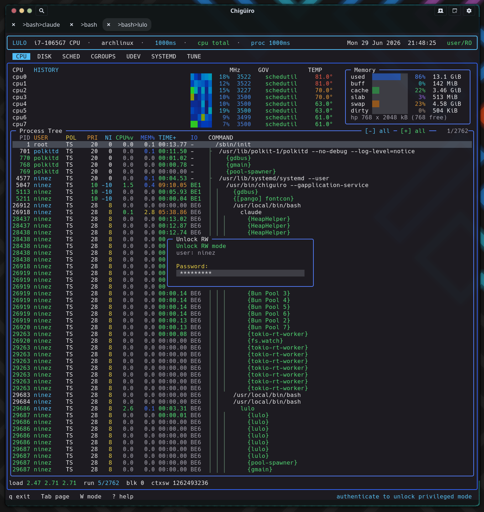

# Lulo -- Process Model & IPC

Lulo is three processes joined by two Unix-socket protocols and split across one privilege boundary, with two distinct escalation paths behind it: a session-scoped RW lease (authenticated by a polkit agent embedded *inside* the TUI) and a narrow `pkexec` helper for tunable writes.

## Table of Contents

1. [Topology](#1-topology)
2. [The two sockets](#2-the-two-sockets)
3. [Wire protocol](#3-wire-protocol)
4. [The FULL vs ACTIVE refresh model](#4-the-full-vs-active-refresh-model)
5. [RW mode and the embedded auth agent](#5-rw-mode-and-the-embedded-auth-agent)
6. [The RW lease and the request guard](#6-the-rw-lease-and-the-request-guard)
7. [Privileged edit sessions](#7-privileged-edit-sessions)
8. [Proc tracing](#8-proc-tracing)
9. [The second privilege path: pkexec](#9-the-second-privilege-path-pkexec)
10. [Security properties](#10-security-properties)
11. [See also](#11-see-also)

---

## 1. Topology

The frontend `lulo` runs as the user and never writes a system file. The unprivileged session daemon `lulod` caches state and integrates with the desktop. The privileged daemon `lulod-system` runs as root and is the only component that applies scheduling policy, edits system files, or traces processes. Two separate escalation paths cross the privilege boundary.

<div class="diagram-container">
<svg width="100%" viewBox="0 0 980 470" xmlns="http://www.w3.org/2000/svg">
  <style>
    .bg      { fill: #1a1b26; }
    .ui      { fill: #1a2a1a; stroke: #9ece6a; stroke-width: 1.5; }
    .sess    { fill: #1a2235; stroke: #7aa2f7; stroke-width: 1.5; }
    .priv    { fill: #2a1f35; stroke: #bb9af7; stroke-width: 1.5; }
    .box     { fill: #24283b; stroke: #3b4261; stroke-width: 1; }
    .lbl     { fill: #c0caf5; font-size: 11px; font-family: 'JetBrains Mono', monospace; }
    .lbl-sm  { fill: #c0caf5; font-size: 10px; font-family: 'JetBrains Mono', monospace; }
    .lbl-mut { fill: #8c92b3; font-size: 9px;  font-family: 'JetBrains Mono', monospace; }
    .lbl-grn { fill: #9ece6a; font-size: 12px; font-weight: bold; font-family: 'JetBrains Mono', monospace; }
    .lbl-blu { fill: #7aa2f7; font-size: 12px; font-weight: bold; font-family: 'JetBrains Mono', monospace; }
    .lbl-pur { fill: #bb9af7; font-size: 12px; font-weight: bold; font-family: 'JetBrains Mono', monospace; }
    .lbl-cy  { fill: #7dcfff; font-size: 10px; font-family: 'JetBrains Mono', monospace; }
    .lbl-yel { fill: #e0af68; font-size: 10px; font-weight: bold; font-family: 'JetBrains Mono', monospace; }
    .ln      { stroke: #7dcfff; stroke-width: 1.5; fill: none; }
    .ln-y    { stroke: #e0af68; stroke-width: 1.5; stroke-dasharray: 5,3; fill: none; }
    .bound   { stroke: #6b7398; stroke-width: 1.2; stroke-dasharray: 6,4; fill: none; }
    .title   { fill: #7aa2f7; font-size: 14px; font-weight: bold; font-family: 'JetBrains Mono', monospace; }
  </style>
  <rect x="0" y="0" width="980" height="470" class="bg"/>
  <text x="490" y="26" text-anchor="middle" class="title">Two sockets, one privilege boundary, two escalation paths</text>

  <rect x="40"  y="56" width="240" height="70" class="ui"/>
  <text x="60"  y="80"  class="lbl-grn">lulo</text>
  <text x="60"  y="98"  class="lbl-mut">TUI, runs as user</text>
  <text x="60"  y="112" class="lbl-mut">embeds polkit auth agent</text>

  <rect x="370" y="56" width="240" height="70" class="sess"/>
  <text x="390" y="80"  class="lbl-blu">lulod</text>
  <text x="390" y="98"  class="lbl-mut">session daemon, runs as user</text>
  <text x="390" y="112" class="lbl-mut">snapshot cache + focus</text>

  <line x1="280" y1="82" x2="370" y2="82" class="ln"/>
  <text x="292" y="74" class="lbl-cy">$XDG_RUNTIME_DIR/lulod.sock</text>
  <text x="292" y="120" class="lbl-mut">no peer-cred check (per-user)</text>

  <rect x="700" y="56" width="240" height="70" class="box"/>
  <text x="720" y="80"  class="lbl-cy">snapshot backends</text>
  <text x="720" y="98"  class="lbl-mut">systemd / tune / cgroups /</text>
  <text x="720" y="112" class="lbl-mut">udev / sched, FULL + ACTIVE</text>
  <line x1="610" y1="90" x2="700" y2="90" class="ln"/>

  <line x1="20" y1="200" x2="960" y2="200" class="bound"/>
  <text x="490" y="194" text-anchor="middle" class="lbl-yel">SO_PEERCRED + RW lease  --  privilege boundary</text>

  <line x1="160" y1="126" x2="160" y2="250" class="ln-y"/>
  <text x="172" y="170" class="lbl-yel">pkexec lulo-admin</text>
  <text x="172" y="184" class="lbl-mut">apply-tune (path B)</text>

  <line x1="490" y1="126" x2="490" y2="250" class="ln"/>
  <text x="502" y="230" class="lbl-cy">/run/lulod-system.sock  (path A)</text>

  <rect x="40"  y="252" width="300" height="64" class="box"/>
  <text x="60"  y="274" class="lbl-cy">lulo-admin</text>
  <text x="60"  y="290" class="lbl-mut">root, validates path allowlist,</text>
  <text x="60"  y="304" class="lbl-mut">writes /proc/sys, /sys, cgroup</text>

  <rect x="370" y="252" width="570" height="180" class="priv"/>
  <text x="390" y="276" class="lbl-pur">lulod-system  --  privileged daemon (root)</text>
  <rect x="390" y="288" width="250" height="56" class="box"/>
  <text x="515" y="308" text-anchor="middle" class="lbl-sm">RW lease table</text>
  <text x="515" y="324" text-anchor="middle" class="lbl-mut">(uid, pid, start_time) x16</text>
  <rect x="660" y="288" width="260" height="56" class="box"/>
  <text x="790" y="308" text-anchor="middle" class="lbl-sm">scheduler engine</text>
  <text x="790" y="324" text-anchor="middle" class="lbl-mut">/proc scan + apply</text>
  <rect x="390" y="356" width="250" height="56" class="box"/>
  <text x="515" y="376" text-anchor="middle" class="lbl-sm">edit sessions</text>
  <text x="515" y="392" text-anchor="middle" class="lbl-mut">realpath + allowlist + rename</text>
  <rect x="660" y="356" width="260" height="56" class="box"/>
  <text x="790" y="376" text-anchor="middle" class="lbl-sm">proc tracing</text>
  <text x="790" y="392" text-anchor="middle" class="lbl-mut">sandboxed strace session</text>
</svg>
</div>

## 2. The two sockets

Both boundaries are `AF_UNIX` / `SOCK_STREAM` sockets, but their trust models differ.

| Boundary | Path | Access control |
| --- | --- | --- |
| `lulo <-> lulod` | `$XDG_RUNTIME_DIR/lulod.sock` (else `/tmp/lulod-<uid>.sock`) | Filesystem only (the runtime dir is mode 0700); no peer-cred check |
| `lulod <-> lulod-system` | `/run/lulod-system.sock` (override `LULOD_SYSTEM_SOCKET`) | `chmod 0666`, world-connectable; every accept reads `SO_PEERCRED` |

The session socket is per-user and unprivileged, so it simply trusts any local connector. The system socket is deliberately world-connectable -- access control is **not** filesystem-based -- because it is enforced per request via the kernel-supplied peer credentials plus the RW lease (below). When `lulod` binds its socket it does a small but careful thing: rather than blindly unlinking a stale socket, it *connect-probes* first, so it never deletes the socket of a daemon that is already running.

## 3. Wire protocol

Both protocols are hand-rolled, field-by-field streaming serializations over the stream socket -- there is no overall length prefix, so reader and writer must agree exactly on the schema for each message type. Each message opens with a three-`uint32` header.

| Protocol | Magic | Version |
| --- | --- | --- |
| `lulod` | `0x4c554c4f` ("LULO") | 13 |
| `lulod-system` | `0x4c555359` ("LUSY") | 9 |

Requests carry `magic, version, type`; responses carry `magic, version, int32 status` (plus an error string when status is negative). A mismatched magic or version is a hard reject. The format is **native-endian and ABI-tied** (raw `int32` / `uint64` / enum casts, no `htonl`), which is correct for same-host Unix sockets but is a hard "local single-host only" constraint.

The request type tells the daemon what you want. The session daemon's requests cover the five cached pages:

```text
lulod:  SYSTEMD_FULL/ACTIVE, TUNE_FULL/ACTIVE/SAVE_SNAPSHOT/SAVE_PRESET/APPLY_SELECTED,
        SCHED_FULL/ACTIVE/RELOAD/APPLY_PRESET, CGROUPS_FULL/ACTIVE, UDEV_FULL/ACTIVE
```

The system daemon's requests cover scheduling, editing, tracing, and auth:

```text
lulod-system:  SCHED_FULL, SCHED_RELOAD, SCHED_FOCUS_UPDATE, EDIT_BEGIN, EDIT_COMMIT,
               EDIT_CANCEL, FILE_WRITE, FILE_DELETE, SCHED_APPLY_PRESET,
               TRACE_BEGIN, TRACE_END, AUTH_UNLOCK, AUTH_LOCK
```

## 4. The FULL vs ACTIVE refresh model

The session-daemon pages share one refresh pattern that keeps the UI cheap. Every page can ask for two granularities:

- **`FULL`** returns the cached snapshot -- the whole list -- refreshed only when its TTL (mostly ~5s) has expired. This is the expensive gather (a systemd inventory, a cgroup walk), so it is throttled.
- **`ACTIVE`** re-renders just the *selected* item's live detail against the cached list. This is what runs as you move the cursor, so the preview stays current without re-gathering everything.

The request payload is the page's UI **state** (cursors, scroll offsets, selection) so the daemon can compute the right "active" preview; the response is the domain **snapshot**. On the frontend side, a worker-thread backend holds the latest snapshot with a monotonic generation counter, and the render loop only repaints when the generation advances -- so idle daemons cost zero frames. If the socket is missing, the backend will try to start `lulod` via its systemd user unit and then by forking it directly, throttled to once a second.

## 5. RW mode and the embedded auth agent

The frontend boots **read-only**. RW mode is a per-session unlock (toggled with `Shift+W`) that lets you perform privileged writes, edits, traces, and preset-applies through `lulod-system`. What makes it unusual is *how the authentication happens*: the password prompt is rendered **inside the Notcurses TUI**, because the frontend registers its own polkit agent.

<div class="diagram-container">
<svg width="100%" viewBox="0 0 980 360" xmlns="http://www.w3.org/2000/svg">
  <style>
    .bg      { fill: #1a1b26; }
    .ui      { fill: #1a2a1a; stroke: #9ece6a; stroke-width: 1.5; }
    .priv    { fill: #2a1f35; stroke: #bb9af7; stroke-width: 1.5; }
    .pk      { fill: #2a2438; stroke: #e0af68; stroke-width: 1.5; }
    .lbl-sm  { fill: #c0caf5; font-size: 10px; font-family: 'JetBrains Mono', monospace; }
    .lbl-mut { fill: #8c92b3; font-size: 9px;  font-family: 'JetBrains Mono', monospace; }
    .lbl-grn { fill: #9ece6a; font-size: 11px; font-weight: bold; font-family: 'JetBrains Mono', monospace; }
    .lbl-pur { fill: #bb9af7; font-size: 11px; font-weight: bold; font-family: 'JetBrains Mono', monospace; }
    .lbl-yel { fill: #e0af68; font-size: 11px; font-weight: bold; font-family: 'JetBrains Mono', monospace; }
    .ln      { stroke: #7dcfff; stroke-width: 1.5; fill: none; }
    .lbl-n   { fill: #7dcfff; font-size: 9px; font-family: 'JetBrains Mono', monospace; }
    .title   { fill: #7aa2f7; font-size: 14px; font-weight: bold; font-family: 'JetBrains Mono', monospace; }
  </style>
  <rect x="0" y="0" width="980" height="360" class="bg"/>
  <text x="490" y="26" text-anchor="middle" class="title">RW unlock: polkit authenticates through the TUI's own agent</text>

  <rect x="40"  y="120" width="220" height="90" class="ui"/>
  <text x="60"  y="146" class="lbl-grn">lulo (TUI)</text>
  <text x="60"  y="164" class="lbl-mut">worker thread registers a</text>
  <text x="60"  y="178" class="lbl-mut">PolkitAgentListener at</text>
  <text x="60"  y="192" class="lbl-mut">/io/lulo/AuthAgent</text>

  <rect x="380" y="120" width="220" height="90" class="priv"/>
  <text x="400" y="146" class="lbl-pur">lulod-system</text>
  <text x="400" y="164" class="lbl-mut">checks authorization for</text>
  <text x="400" y="178" class="lbl-mut">io.lulo.system.unlock-rw</text>
  <text x="400" y="192" class="lbl-mut">ALLOW_USER_INTERACTION</text>

  <rect x="720" y="120" width="220" height="90" class="pk"/>
  <text x="740" y="146" class="lbl-yel">polkitd</text>
  <text x="740" y="164" class="lbl-mut">needs to authenticate -></text>
  <text x="740" y="178" class="lbl-mut">calls back into lulo's</text>
  <text x="740" y="192" class="lbl-mut">registered agent</text>

  <line x1="260" y1="150" x2="380" y2="150" class="ln"/>
  <text x="268" y="142" class="lbl-n">1. AUTH_UNLOCK</text>
  <line x1="600" y1="150" x2="720" y2="150" class="ln"/>
  <text x="612" y="142" class="lbl-n">2. check_authorization</text>
  <line x1="720" y1="186" x2="260" y2="186" class="ln"/>
  <text x="430" y="178" class="lbl-n">3. prompt rendered in the TUI -> user types password -> response</text>

  <text x="60"  y="250" class="lbl-mut">4. on success, lulod-system records an RW lease for (uid, pid, start_time);</text>
  <text x="60"  y="266" class="lbl-mut">   the TUI sets rw_mode = 1 and the status bar flips to "root/RW".</text>
  <text x="60"  y="290" class="lbl-mut">Shift+W again sends AUTH_LOCK, revoking the lease; a daemon restart drops all leases.</text>
</svg>
</div>

<figure class="screenshot">
  
  <figcaption>The RW-mode unlock: polkit's password prompt is drawn as an overlay inside the Notcurses TUI via Lulo's own registered agent.</figcaption>
</figure>

The flow: pressing `Shift+W` spawns a worker thread that registers a `PolkitAgentListener` for the calling process (subject built from pid + start-time + uid) at object path `/io/lulo/AuthAgent`, and in parallel sends `AUTH_UNLOCK` to `lulod-system`. The system daemon asks polkit to authorize the action `io.lulo.system.unlock-rw` with user interaction allowed. polkit, needing a password, calls back into the frontend's *own* registered agent -- whose prompt, info, and error signals are marshalled into the TUI and drawn as an auth overlay. Keystrokes flow back as the polkit session response. On success the TUI sets `rw_mode = 1`; on failure it surfaces the polkit error.

## 6. The RW lease and the request guard

Authorization on the daemon side is an in-memory **lease table** (16 slots) of `{active, uid, pid, start_time}`. On a successful unlock the daemon records a lease keyed on the kernel-reported peer `uid` and `pid` plus the process `start_time` read from `/proc` -- which pins the lease to *this exact process instance* and defeats PID reuse. Leases live only in process memory, so restarting `lulod-system` drops them all and forces re-authentication.

Every mutating privileged request passes through `require_rw_lease`: root bypasses, otherwise the daemon re-reads the peer's current start-time and demands an exact `(uid, pid, start_time)` match, returning `EPERM` if absent.

| Lease-gated (need RW) | Not lease-gated |
| --- | --- |
| `SCHED_APPLY_PRESET`, `EDIT_BEGIN`, `EDIT_COMMIT` | `SCHED_FULL`, `SCHED_RELOAD` (reads) |
| `FILE_WRITE`, `FILE_DELETE`, `TRACE_BEGIN` | `SCHED_FOCUS_UPDATE`, `AUTH_LOCK` |
| | `EDIT_CANCEL`, `TRACE_END` (ownership-checked instead) |

The frontend also has a `path_requires_rw` check (paths under `/etc`, `/usr`, `/lib`, `/proc`, `/sys`, `/run/udev`, `/run/systemd`) that blocks an action with "RO mode: Shift+W for root/RW" before it ever hits the wire -- but that is purely advisory UX. The daemon's lease guard is the authoritative gate and never trusts the frontend's check.

## 7. Privileged edit sessions

Editing a system file abstracts the privilege away: the frontend tries the unprivileged path first and only escalates on failure.

1. **Begin.** If `access(path, W_OK)` succeeds, the user can edit in place -- no daemon involved. Otherwise the frontend sends `EDIT_BEGIN`. The daemon resolves the real path with `realpath`, checks it against an **allowlist of prefixes** (`/etc/lulo/scheduler/`, `/proc/sys/kernel/sched_`, `/sys/devices/system/cpu/cpufreq/`, the systemd dirs, `/sys/fs/cgroup/`, the udev dirs), opens the source `O_RDONLY|O_NOFOLLOW`, copies it into a `mkstemp` temp under `/run/user/<uid>/lulo-edit/`, and chowns that copy 0600 to the user. It returns a session id and the path to the user-owned copy.
2. **Edit.** The frontend opens the *copy* in `$VISUAL` / `$EDITOR`. The user edits a private file they own.
3. **Commit.** `EDIT_COMMIT` re-checks the session's `uid` ownership and re-validates the scope, then writes back. For real files this is **atomic**: a same-directory `mkstemp`, content copy, mode/owner preserved, `fsync`, then `rename()` over the original. For kernel pseudo-files (cgroup controllers, sched tunables) it writes in place, since atomic rename is not meaningful there. `O_NOFOLLOW` is used throughout to block symlink races, and committing a scheduler file triggers a config reload + rescan.

`EDIT_CANCEL` (ownership-checked, not lease-gated) cleans up the copy and meta. Direct `FILE_WRITE` / `FILE_DELETE` follow the same realpath-and-allowlist discipline for editor-less changes.

## 8. Proc tracing

The `s` key on the CPU page starts a trace of the selected process. It does **not** call `ptrace` directly -- `lulod-system` (as root) forks and execs the system `strace` binary:

```text
strace -f -s 256 -yy -ttt -p <pid>
```

Before spawning, it pre-flights: the PID must exist (`kill(pid,0)`), `readlink(/proc/<pid>/exe)` must succeed (rejecting kernel threads), and `/usr/bin/strace` must be executable. Output is written to `/run/user/<uid>/lulo-trace/<session_id>.log`, created 0600 and chowned to the requesting user so only they can read it. The `session_id` is strictly validated to `[A-Za-z0-9._-]` before any path interpolation, which closes off path traversal, and a root-only meta file records the owning uid, child pid, target pid, and output path. `TRACE_END` enforces that the requester owns the session (so the owner can always stop their own trace), then `SIGTERM` → grace → `SIGKILL` and unlinks the files. Privilege is required because attaching to an arbitrary process needs `CAP_SYS_PTRACE`; routing it through the root daemon and chowning the log to the user is what makes it both possible and readable.

## 9. The second privilege path: pkexec

Tunable application (the [Tune page](tune.gen.html)'s `apply`) uses a separate, simpler escalation route, independent of the lease machinery. `lulod` builds a small plan (a `lulo-admin-tune-v1` header plus `path<TAB>value` lines) and runs `pkexec lulo-admin apply-tune`, piping the plan to the helper on stdin. The `lulo-admin` helper refuses to run unless it is root and the verb is `apply-tune`, and it validates every path through `realpath` + a prefix allowlist limited to `/proc/sys`, `/sys`, and `/sys/fs/cgroup` before writing. polkit gates it via the `io.lulo.admin.pkexec.apply-tune` action.

So there are two polkit actions and two privilege models by design: the **lease path** (broad, session-stateful, for scheduler/edit/trace) and the **pkexec path** (narrow, stateless, for tunable writes only).

## 10. Security properties

The design concentrates privilege and validates aggressively at the boundary.

- **Peer credentials are the trust anchor.** The system socket reads `SO_PEERCRED` on every accept; the frontend cannot lie about its uid or pid.
- **Leases and ownership are PID-reuse-hardened.** Lease, edit, and trace ownership are all keyed on `(uid, pid, start_time)`, so a recycled PID can never inherit another process's authorization.
- **TOCTOU defenses throughout.** `realpath` before every allowlist check, `O_NOFOLLOW` everywhere, same-directory `mkstemp`+`rename` with preserved owner/mode, and scope re-validation at commit time.
- **The advisory check is never trusted.** The frontend's `path_requires_rw` is convenience only; the daemon re-checks the lease independently.

Two properties are worth flagging for maintainers. The system socket is intentionally world-connectable (0666), so security rests entirely on the per-request lease and ownership checks -- a new request handler that forgets `require_rw_lease` would be an instant privilege hole. And the deserializers do not cap string/array lengths, which is low-risk on a local peer-checked socket but means a hostile local process could trigger large allocations; the version field is the only compatibility guard.

## 11. See also

- [Architecture Overview](architecture.gen.html)
- [Scheduler](scheduler.gen.html) -- the largest consumer of the privileged path
- [Focus Providers](focus-providers.gen.html) -- `SCHED_FOCUS_UPDATE` across the boundary
- [Tune View](tune.gen.html) -- the pkexec apply path
- [CPU & Process View](cpu.gen.html) -- where tracing is launched
