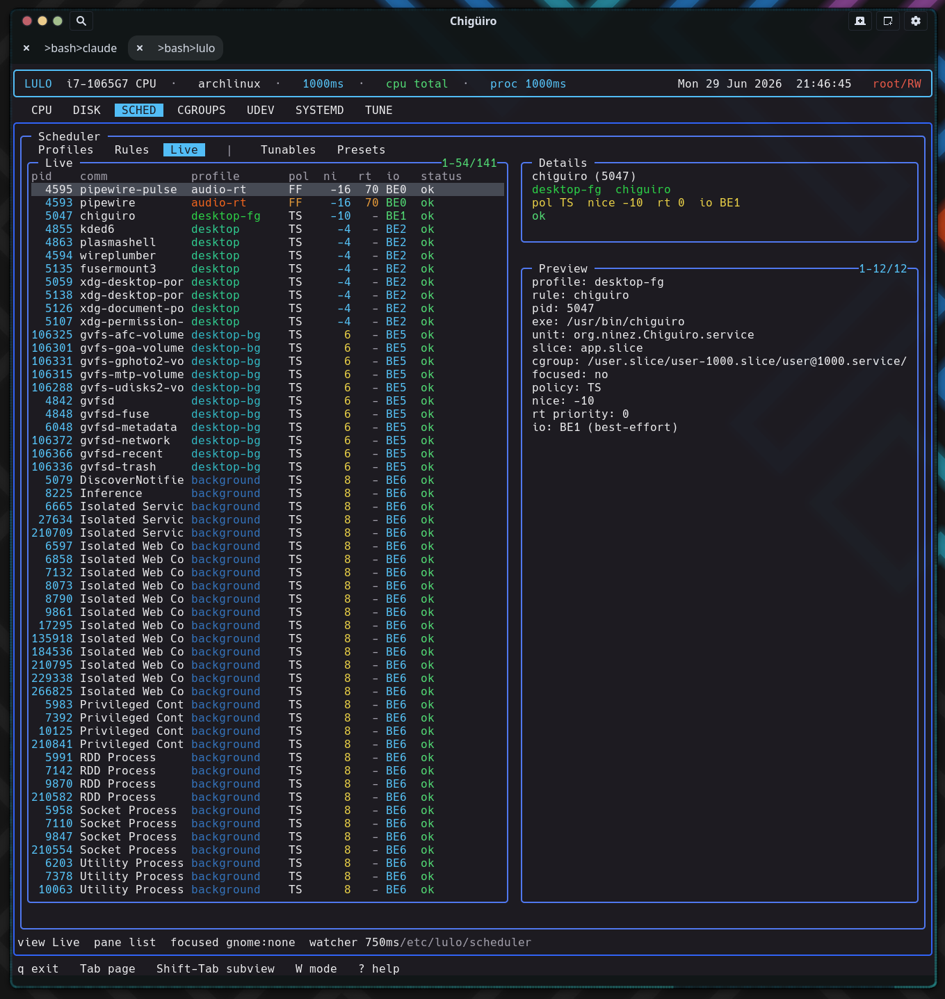

# Lulo -- Scheduler

The scheduler is Lulo's most substantial subsystem: a privileged, continuously re-enforcing `/proc` watcher that resolves each process to exactly one sparse profile -- by exclusion, window focus, explicit rule, or background fallback -- and applies nice, scheduling policy, RT priority, and I/O priority directly through syscalls every interval.

## Table of Contents

1. [The shape of the scheduler](#1-the-shape-of-the-scheduler)
2. [Config model](#2-config-model)
3. [Profiles as sparse overlays](#3-profiles-as-sparse-overlays)
4. [Rules and matchers](#4-rules-and-matchers)
5. [Policy resolution order](#5-policy-resolution-order)
6. [The enforcement loop](#6-the-enforcement-loop)
7. [How policy is applied](#7-how-policy-is-applied)
8. [Dynamic policy: focus and background](#8-dynamic-policy-focus-and-background)
9. [Tunables and presets](#9-tunables-and-presets)
10. [The SCHED page](#10-the-sched-page)
11. [Design notes](#11-design-notes)
12. [See also](#12-see-also)

---

## 1. The shape of the scheduler

Lulo's scheduler is a policy layer for Linux process priority. It is closer to a compact policy daemon than a one-shot `chrt` / `renice` wrapper: it loads file-backed config, scans every process on a fixed interval, classifies each one, and applies scheduling attributes -- then does it all again on the next tick so policy stays enforced as processes come and go.

| Process | Scheduler role |
| --- | --- |
| `lulo` | Renders the `SCHED` page and opens config files in `$VISUAL` / `$EDITOR` |
| `lulod` | Serves scheduler snapshots to the TUI and forwards focused-PID updates |
| `lulod-system` | Loads config, scans `/proc`, applies policy, and re-enforces over time |

Only the privileged daemon `lulod-system` ever issues a scheduling syscall. The engine lives in `src/daemon/lulod_system_sched.c` (about 2,000 lines); per-process metadata collection is shared code in `src/shared/lulo_proc_meta.c`.

## 2. Config model

The config is a directory tree, not one large DSL file. The root is `/etc/lulo/scheduler` (overridable via `LULOD_SYSTEM_CONFIG_DIR`).

| Path | Purpose |
| --- | --- |
| `scheduler.conf` | Global settings |
| `profiles.d/*.conf` | Profile definitions |
| `rules.d/*.conf` | Rule definitions |
| `tunables-presets.d/*.conf` | Kernel-tunable presets |

Only regular files ending in `.conf` (and not dot-files) are loaded, gathered with `scandir` + `alphasort` so the load order is lexical -- which is why the shipped files are numbered (`10-audio-rt.conf`, `14-exclude-lulo.conf`, ...). All three parsers share the same strict line handling: trim, skip blanks and `#`/`;` comments, require `key=value`, and treat an **unknown key as a hard parse error**. A missing `scheduler.conf` is non-fatal; the defaults below are seeded before parsing.

### Global settings

| Setting | Default | Purpose |
| --- | --- | --- |
| `watcher_interval_ms` | `1000` | Rescan + reapply cadence (range 100--10000) |
| `focus_enabled` | `1` | Enable focused-window boosting |
| `focus_profile` | `focused` | Profile applied to the focused app |
| `background_enabled` | `1` | Enable the app-scope fallback |
| `background_profile` | `background` | Fallback profile |
| `background_match_app_slice` | `1` | Treat `/app.slice/` cgroups as app-scope |
| `background_match_background_slice` | `1` | Treat `/background.slice/` cgroups as app-scope |
| `background_match_app_unit_prefix` | `1` | Treat `app-*` units as app-scope |
| `tunables_startup_preset` | _(none)_ | Preset auto-applied on reload |

The shipped example lowers the cadence to `watcher_interval_ms=750`.

## 3. Profiles as sparse overlays

A profile describes how a matched process should be treated -- but only the fields it actually sets. Every value field is paired with a `has_*` flag, and an unset field means "leave this attribute unchanged." A profile is therefore a **sparse overlay**, not a full scheduling spec.

| Field | Range / values | Meaning |
| --- | --- | --- |
| `name` | string | Profile identifier (defaults to the filename stem) |
| `enabled` | bool (default 1) | Enables or disables the profile |
| `nice` | -20 .. 19 | Linux nice level |
| `policy` | `other` / `batch` / `idle` / `fifo` / `rr` | Scheduling policy |
| `rt_priority` | 1 .. 99 | RT priority for `fifo` / `rr` |
| `io_class` | `none` / `realtime` / `best-effort` / `idle` | Linux I/O class |
| `io_priority` | 0 .. 7 | I/O priority level |

Profiles are sorted by a synthetic "aggressiveness" score (policy rank, plus RT priority, plus `20 − nice`, with disabled profiles pushed down) so the more forceful ones sort first in the UI. Some shipped examples:

| Profile | Settings |
| --- | --- |
| `audio-rt` | `nice=-16, policy=fifo, rt_priority=70, io_class=best-effort, io_priority=0` |
| `desktop-rt` | `policy=rr, rt_priority=8` (compositor-critical processes) |
| `focused` | `nice=-20, io_class=best-effort, io_priority=0` |
| `background` | lower-priority fallback for app-scope processes |
| `idle` | `nice=19, policy=idle, io_class=idle` (yields aggressively) |

Because a profile only writes the dimensions it sets, different profiles compose on orthogonal axes instead of clobbering each other -- and resolution always picks exactly one winner per process, so there is no double-apply.

## 4. Rules and matchers

Rules decide which profile applies to which processes. A rule is enabled by default and carries a matcher kind, a glob pattern, and a target profile (or an `exclude` flag).

| Field | Meaning |
| --- | --- |
| `enabled` | Enables or disables the rule (default 1) |
| `exclude` | If set, matched processes are dropped entirely (profile is cleared) |
| `match` | Matcher kind (default `comm`) |
| `pattern` | `fnmatch` glob -- **required** |
| `profile` | Target profile -- required unless `exclude` |

Matching is plain `fnmatch` glob against a field of the process's metadata. Six matcher kinds map to six fields:

| Matcher | Field matched | Source |
| --- | --- | --- |
| `comm` | Command name | `/proc/PID/stat` |
| `exe` | Executable path (falls back to basename) | `readlink /proc/PID/exe` |
| `cmdline` | Full command line | `/proc/PID/cmdline` |
| `unit` | systemd unit | Derived from the cgroup path suffix (`.service` / `.scope`) |
| `slice` | systemd slice | Derived from the cgroup path suffix (`.slice`) |
| `cgroup` | Full cgroup path | `/proc/PID/cgroup` (unified v2 line) |

The `exe` matcher tries the full path and then the basename, so `pattern=jackd` matches `/usr/bin/jackd`. Crucially, `unit` and `slice` are **derived from the cgroup path**, not queried from systemd -- so the whole scheduler stays systemd-API-free while still classifying by unit and slice. This is the same cgroup structure you can browse on the [Cgroups page](cgroups.gen.html).

Rules are scanned in a sorted order and the **first enabled match wins**. An `exclude` match drops the process completely (no profile, no focus, no background). A non-exclude match whose target profile is disabled or missing is skipped, so a lower-priority rule can still apply.

## 5. Policy resolution order

For every process, the scan resolves a single effective profile in a strict precedence: **exclusion → focus override → explicit rule → background fallback**.

<svg width="100%" viewBox="0 0 980 470" xmlns="http://www.w3.org/2000/svg">
  
  <rect x="0" y="0" width="980" height="470" class="bg"/>
  <text x="490" y="26" text-anchor="middle" class="title">Per-process policy resolution</text>

  <rect x="380" y="46" width="220" height="38" class="step"/>
  <text x="490" y="69" text-anchor="middle" class="lbl">process from /proc scan</text>

  <rect x="380" y="110" width="220" height="44" class="step"/>
  <text x="490" y="130" text-anchor="middle" class="lbl-sm">1. matching rule?</text>
  <text x="490" y="145" text-anchor="middle" class="lbl-mut">first enabled fnmatch wins</text>

  <rect x="700" y="112" width="240" height="40" class="drop"/>
  <text x="820" y="130" text-anchor="middle" class="lbl-red">exclude -> drop process</text>
  <text x="820" y="144" text-anchor="middle" class="lbl-mut">unmanaged, no profile</text>

  <rect x="380" y="184" width="220" height="44" class="focus"/>
  <text x="490" y="204" text-anchor="middle" class="lbl-sm">2. focus override?</text>
  <text x="490" y="219" text-anchor="middle" class="lbl-mut">pid+start / unit / cgroup</text>

  <rect x="700" y="186" width="240" height="40" class="focus"/>
  <text x="820" y="210" text-anchor="middle" class="lbl-grn">apply focus_profile  (focused)</text>

  <rect x="380" y="258" width="220" height="44" class="rule"/>
  <text x="490" y="278" text-anchor="middle" class="lbl-sm">3. explicit rule matched?</text>
  <text x="490" y="293" text-anchor="middle" class="lbl-mut">from step 1</text>

  <rect x="700" y="260" width="240" height="40" class="rule"/>
  <text x="820" y="284" text-anchor="middle" class="lbl-grn">apply the rule's profile</text>

  <rect x="380" y="332" width="220" height="44" class="bgf"/>
  <text x="490" y="352" text-anchor="middle" class="lbl-sm">4. app-scope process?</text>
  <text x="490" y="367" text-anchor="middle" class="lbl-mut">app.slice / background.slice / app-*</text>

  <rect x="700" y="334" width="240" height="40" class="bgf"/>
  <text x="820" y="358" text-anchor="middle" class="lbl-grn">apply background_profile</text>

  <rect x="380" y="406" width="220" height="40" class="step"/>
  <text x="490" y="430" text-anchor="middle" class="lbl-mut">unmanaged (left as-is)</text>

  <line x1="490" y1="84"  x2="490" y2="110" class="ln"/>
  <line x1="490" y1="154" x2="490" y2="184" class="ln-no"/>
  <line x1="600" y1="132" x2="700" y2="132" class="ln"/>
  <text x="612" y="126" class="lbl-red">exclude</text>
  <line x1="490" y1="228" x2="490" y2="258" class="ln-no"/>
  <line x1="600" y1="206" x2="700" y2="206" class="ln"/>
  <text x="624" y="200" class="lbl-grn">yes</text>
  <line x1="490" y1="302" x2="490" y2="332" class="ln-no"/>
  <line x1="600" y1="280" x2="700" y2="280" class="ln"/>
  <text x="624" y="274" class="lbl-grn">yes</text>
  <line x1="490" y1="376" x2="490" y2="406" class="ln-no"/>
  <line x1="600" y1="354" x2="700" y2="354" class="ln"/>
  <text x="624" y="348" class="lbl-grn">yes</text>
</svg>

Focus matches a process when it is the exact focused PID (verified by start-time), **or** shares the focused window's systemd unit, **or** shares its cgroup -- so focusing an app boosts its whole unit/cgroup, not just the one window-owning thread. A process is "app-scope" for the background fallback when its cgroup contains `/app.slice/` or `/background.slice/`, or its unit begins with `app-` (each gated by the matching `background_match_*` flag). Anything that falls through all four steps is left exactly as the kernel had it.

## 6. The enforcement loop

`lulod-system` runs one `poll()` loop over its control socket with a computed timeout. When the timeout expires it rescans `/proc` and reapplies policy, then reschedules for `watcher_interval_ms` later (clamped to at least 100ms). A focus update or a config reload triggers an **immediate** rescan rather than waiting for the next tick.

Each scan drops any stale focus target (start-time mismatch), iterates the numeric `/proc` entries, collects each process's metadata, resolves its profile, reads its current scheduling state, applies the target, and records a live row. The whole tree is re-evaluated every interval -- that continuous re-enforcement is what makes the scheduler hold policy over time instead of losing it the moment a process re-execs or a new one spawns.

## 7. How policy is applied

Applying a profile is **idempotent**: each attribute is written only when the current value differs from the target, so a steady-state system issues almost no syscalls. Three mechanisms cover the four dimensions:

| Dimension | Syscall |
| --- | --- |
| nice | `setpriority(PRIO_PROCESS, pid, nice)` |
| policy + RT priority | `sched_setscheduler(pid, policy, &param)` |
| I/O class + priority | `ioprio_set(IOPRIO_WHO_PROCESS, pid, value)` |

For `fifo` / `rr` the RT priority is the profile's `rt_priority` (or a floor of 1 if unset); non-RT policies force priority 0. The I/O target has a subtle promotion: setting only `io_priority` promotes a `none`-class process to `best-effort`, and setting only `io_class` defaults the priority to 4. After applying, the engine re-queries the actual state and reports `applied` / `ok` or a per-syscall error -- and it suppresses a spurious error when a write "failed" only because the value was already correct (for example an `EPERM` on a setting that already matched), which keeps the status column quiet for processes it cannot or need not change.

> **One caveat worth knowing:** `SCHED_DEADLINE` is ranked and labeled (`DLN`) in the code, but the apply path only ever calls `sched_setscheduler` with a plain `sched_param`. It never builds the `sched_attr` (runtime / deadline / period) that `SCHED_DEADLINE` requires, and there is no `sched_setattr` call anywhere -- so a profile requesting deadline scheduling would fail to apply. The five working policies are `other`, `batch`, `idle`, `fifo`, and `rr`.

## 8. Dynamic policy: focus and background

Two built-in policies are exposed in `SCHED → Rules` as the synthetic, display-only rows `(focus)` and `(background)`. They are configured through `scheduler.conf`, not separate rule files.

**Focus.** The focus monitor runs in `lulod`, which forwards the focused-window PID (and its start-time and provider) to `lulod-system`. The system daemon re-collects metadata for that PID, verifies the start-time matches (a PID-reuse guard), records the focus target, and runs an immediate rescan. From then on, any process matching that target by PID, unit, or cgroup gets `focus_profile`. See [Focus Providers](focus-providers.gen.html) for how the PID is detected on KDE and GNOME.

**Background.** Any app-scope process not already excluded, focused, or matched by an explicit rule falls through to `background_profile`. "App-scope" is decided purely from the cgroup and unit, as described in the resolution order above.

**Self-exclusion is config, not code.** There is no hardcoded guard preventing the scheduler from renicing its own processes -- protection comes entirely from the shipped exclude rules: `14-exclude-lulo.conf` (`comm` glob `lulo*`), `13-exclude-prio-tools.conf` (`chrt`), plus excludes for `dbus`, `systemd`, and `rtkit`. A deployment that deletes these would let the scheduler manage those processes, so they are part of the contract, not incidental.

## 9. Tunables and presets

The scheduler controls grew a kernel-tunables layer (commit `a3d9b10`): `lulod-system` discovers a curated, allowlisted set of read/write knobs -- `/proc/sys/kernel/sched_*`, `cpufreq`, `intel_pstate` / `amd_pstate`, `cpuidle`, and SMT control -- with every path re-validated through `realpath` and a prefix check so symlink or traversal escapes are rejected.

Presets are `key=value` files of absolute tunable paths applied atomically, each path re-validated at apply time. The `tunables_startup_preset` setting auto-applies a named preset on every reload, and preset application is gated behind the RW authorization lease (see [Process Model & IPC](process-model-ipc.gen.html)). This is the scheduler-side counterpart to the standalone [Tune page](tune.gen.html); notably, the RT-throttling knobs (`sched_rt_runtime_us` / `sched_rt_period_us`) are *exposed* here for you to set, but the watcher never auto-tunes them -- protection against RT starvation is left to your `rt_priority` choices and these knobs.

## 10. The SCHED page

The `SCHED` page has five subviews, switched with Shift-Tab.

| Subview | List columns |
| --- | --- |
| `Profiles` | `on`, `profile`, `nice`, `pol`, `rt`, `io` |
| `Rules` | `on`, `match`, `pattern`, `target` (plus the synthetic `(focus)` / `(background)`) |
| `Live` | `pid`, `comm`, `profile`, `pol`, `ni`, `rt`, `io`, `status` |
| `Tunables` | `src`, `group`, `rw`, `name`, `value` |
| `Presets` | `created`, `itms`, `boot`, `name` |

The Live list shows the resolved profile and applied state per process, but **not** which rule won -- the `(focus)` / `(background)` rule name and the `focused: yes/no` flag appear only in the detail pane and the status bar (which reads `view ... pane ... focused ... watcher <ms>`).

<figure class="screenshot">
  
  <figcaption>SCHED → Live: each process with its resolved profile, policy, nice, RT, I/O, and apply status.</figcaption>
</figure>

### Editing workflow

`lulo` is not a text editor; it uses structured navigation plus external-editor handoff.

| Key | Effect |
| --- | --- |
| `i` | Edit the selected profile / rule file (or `scheduler.conf` for `(focus)` / `(background)`) |
| `n` | Create a new profile or rule file and open it in the editor |
| `d` | Delete the selected file-backed profile or rule |
| `R` | Reload scheduler config |
| `a` | Apply the selected preset |

System files are committed through the privileged path, so editing `/etc/lulo` config never requires the TUI itself to run as root.

## 11. Design notes

- **Continuous, idempotent re-enforcement.** The full `/proc` tree is rescanned and reapplied every interval, but syscalls fire only when a value actually needs changing -- so policy is held without log churn or wasted writes.
- **One winner per process.** Sparse-overlay profiles plus single-winner resolution mean mechanisms compose on orthogonal dimensions and never fight each other.
- **PID-reuse safety.** Focus targeting is keyed on PID *and* `/proc` start-time; a mismatch drops the target instantly.
- **systemd-aware without systemd APIs.** Unit and slice classification is derived from the cgroup path, so the engine needs no D-Bus or libsystemd in the hot path.
- **A compact policy daemon.** Continuous scanning, dynamic focus/background policy, and live reporting make this much more than a `chrt`/`renice` front-end.

## 12. See also

- [Architecture Overview](architecture.gen.html)
- [Focus Providers](focus-providers.gen.html) -- how the focused PID reaches the scheduler
- [Process Model & IPC](process-model-ipc.gen.html) -- the privileged path and RW lease
- [Cgroups View](cgroups.gen.html) -- the cgroup/slice/unit structure matchers read against
- [CPU & Process View](cpu.gen.html) -- the live processes being managed
