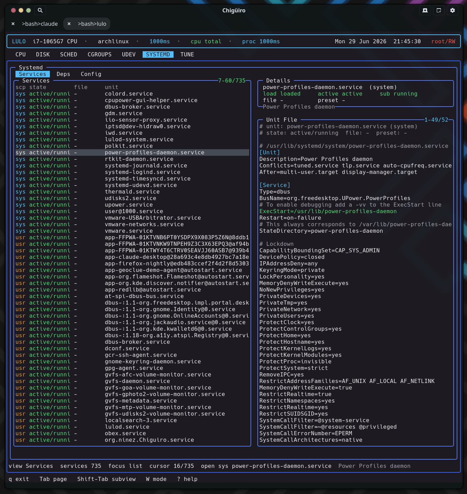

# Lulo -- Systemd View

The `SYSTEMD` page talks to systemd the way systemd's own tools do -- over **sd-bus**, not by shelling out to `systemctl` -- querying both the system and user managers, merging file-enablement with runtime state, and computing true reverse-dependency closures from the bus interface's inverse-relation properties.

## Table of Contents

1. [What the page shows](#1-what-the-page-shows)
2. [How the inventory is gathered](#2-how-the-inventory-is-gathered)
3. [Services view](#3-services-view)
4. [Deps view: real reverse dependencies](#4-deps-view-real-reverse-dependencies)
5. [Config view](#5-config-view)
6. [Editing and snapshots](#6-editing-and-snapshots)
7. [See also](#7-see-also)

---

## 1. What the page shows

`SYSTEMD` is a service inspection and editing surface built for visibility first, with safe file-backed editing before any broader lifecycle management. It runs on the standard client/daemon split: a backend thread in the frontend requests a snapshot from `lulod`, which does the actual sd-bus work and caches the result (see [Process Model & IPC](process-model-ipc.gen.html)).

| Subview | Purpose |
| --- | --- |
| `Services` | The merged system + user unit inventory with state and enablement |
| `Deps` | Reverse dependencies for the selected unit |
| `Config` | systemd config files and drop-ins under `/etc/systemd` |

## 2. How the inventory is gathered

The daemon links `libsystemd` and opens **both** buses -- `sd_bus_open_system` and `sd_bus_open_user` -- gathering each scope separately. For each manager it makes two pattern-filtered calls (the pattern restricts results to `*.service`):

- `ListUnitFilesByPatterns` -> the unit *file* enablement state (enabled / disabled / static / ...).
- `ListUnitsByPatterns` -> the *runtime* state: load, active, sub, description, and the unit's D-Bus object path.

The two result sets are merged per `(scope, unit)`, unit names are `\xNN`-decoded back to their human form, and the list is sorted by a health rank so failed and running units float to the top, inactive ones sink.

<svg width="100%" viewBox="0 0 980 340" xmlns="http://www.w3.org/2000/svg">
  
  <rect x="0" y="0" width="980" height="340" class="bg"/>
  <text x="490" y="26" text-anchor="middle" class="title">SYSTEMD inventory: two buses, two calls, one merged list</text>

  <rect x="40"  y="56" width="200" height="40" class="bus"/>
  <text x="140" y="80" text-anchor="middle" class="lbl-pur">sd_bus_open_system</text>
  <rect x="40"  y="200" width="200" height="40" class="bus"/>
  <text x="140" y="224" text-anchor="middle" class="lbl-pur">sd_bus_open_user</text>

  <rect x="300" y="44" width="250" height="40" class="call"/>
  <text x="425" y="64" text-anchor="middle" class="lbl-sm">ListUnitFilesByPatterns</text>
  <text x="425" y="78" text-anchor="middle" class="lbl-mut">enablement / preset</text>
  <rect x="300" y="96" width="250" height="40" class="call"/>
  <text x="425" y="116" text-anchor="middle" class="lbl-sm">ListUnitsByPatterns</text>
  <text x="425" y="130" text-anchor="middle" class="lbl-mut">load / active / sub / obj path</text>
  <rect x="300" y="200" width="250" height="40" class="call"/>
  <text x="425" y="220" text-anchor="middle" class="lbl-sm">(same two calls, user bus)</text>
  <text x="425" y="234" text-anchor="middle" class="lbl-mut">*.service pattern filter</text>

  <line x1="240" y1="76"  x2="300" y2="64"  class="ln"/>
  <line x1="240" y1="76"  x2="300" y2="116" class="ln"/>
  <line x1="240" y1="220" x2="300" y2="220" class="ln"/>

  <rect x="640" y="110" width="300" height="80" class="merge"/>
  <text x="790" y="138" text-anchor="middle" class="lbl-blu">merge by (scope, unit)</text>
  <text x="790" y="158" text-anchor="middle" class="lbl-mut">decode \xNN names</text>
  <text x="790" y="174" text-anchor="middle" class="lbl-mut">sort by health rank</text>
  <line x1="550" y1="90"  x2="640" y2="150" class="ln"/>
  <line x1="550" y1="116" x2="640" y2="150" class="ln"/>
  <line x1="550" y1="220" x2="640" y2="150" class="ln"/>
</svg>

## 3. Services view

The Services list is the merged inventory. The same list backs both Services and Deps -- only the preview pane differs between them.

| Column | Meaning |
| --- | --- |
| `scp` | Scope: system (cyan) vs user (orange) |
| `state` | Active state / sub-state, health-colored |
| `file` | File enablement (enabled / disabled / static / ...), colored |
| `unit` | Decoded unit name |

Selecting a unit previews its actual on-disk definition. The daemon resolves the unit's object path (via `LoadUnit`), reads the `FragmentPath`, `SourcePath`, `Following`, and `DropInPaths` properties over the bus, and dumps each of those files -- so the preview is the real fragment plus its drop-ins, not a synthesized summary.

<figure class="screenshot">
  
  <figcaption>The Services view: merged system + user inventory on the left, the resolved unit fragment and drop-ins previewed on the right.</figcaption>
</figure>

## 4. Deps view: real reverse dependencies

The Deps view is the technical standout. Rather than parsing `systemctl list-dependencies --reverse`, it asks systemd's Unit interface directly for the **inverse** of every dependency relation -- reading twelve reverse-relation properties over the bus:

`RequiredBy`, `RequisiteOf`, `WantedBy`, `BoundBy`, `UpheldBy`, `ConsistsOf`, `TriggeredBy`, `OnSuccessOf`, `OnFailureOf`, `ReloadPropagatedFrom`, `StopPropagatedFrom`, `ConflictedBy`.

Each list is sorted and printed under a `# <Property>` header, with dependency lines colored by unit suffix (`.target`, `.service`, `.socket`, `.timer`). The result is the full reverse closure across all twelve relation types in a single pass -- the answer to "what else depends on this, and how?" before you change or remove a unit.

## 5. Config view

The Config view lists `.conf` (and `.conf.pacnew`) files under `/etc/systemd`, scanned lazily only when you enter the view. `.pacnew` files -- pending package-manager config updates -- are highlighted in orange so you notice config that needs reconciling. Selecting a file previews its contents with `key=value` lines colored.

## 6. Editing and snapshots

`SYSTEMD` uses the shared external-editor handoff exclusively -- there is no inline editing. The edit path is the selected unit's `FragmentPath` (in Services / Deps) or the config-row path (in Config). Pressing `i` opens it in `$VISUAL` / `$EDITOR`; privileged writes are committed through `lulod-system`'s atomic, allowlist-scoped edit protocol, so editing a unit under `/etc/systemd` or `/usr/lib/systemd` never requires the TUI itself to run as root.

The cached snapshot carries the merged rows plus three separate preview buffers -- one each for the Services fragment, the Deps closure, and the Config file -- so switching views does not re-fetch. The unit list refreshes on a TTL; the preview is re-rendered cheaply when the selection moves.

### Current scope

| What exists today | Not the main workflow yet |
| --- | --- |
| Browse merged system + user units | Broad start / stop / restart lifecycle from the TUI |
| Inspect reverse-dependency closures | A full `systemctl` replacement |
| Inspect and edit unit and config files | Enable / disable as a polished end-user flow |

## 7. See also

- [Cgroups View](cgroups.gen.html) -- the slices and resource directives these units declare
- [Scheduler](scheduler.gen.html) -- `unit` and `slice` matchers source from systemd
- [Udev View](udev.gen.html)
- [Architecture Overview](architecture.gen.html)
