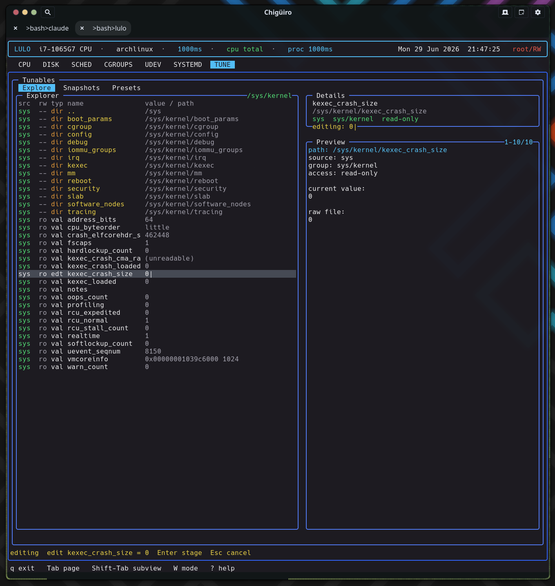

# Lulo -- Tune View

The `TUNE` page is a live explorer over `/proc/sys`, `/sys`, and `/sys/fs/cgroup` with the most elaborate editing model in the app: edits are *staged* in the UI, captured into portable `.ltune` bundles, and applied through a dedicated privileged helper -- so the same file format round-trips capture and restore of kernel tunables.

## Table of Contents

1. [What the page shows](#1-what-the-page-shows)
2. [Explore: a live tunables browser](#2-explore-a-live-tunables-browser)
3. [The three-stage editing model](#3-the-three-stage-editing-model)
4. [Snapshots and presets](#4-snapshots-and-presets)
5. [The .ltune bundle format](#5-the-ltune-bundle-format)
6. [The privileged apply path](#6-the-privileged-apply-path)
7. [See also](#7-see-also)

---

## 1. What the page shows

`TUNE` is built around browsing real kernel state, editing values, and saving reusable bundles. It runs on the client/daemon split: a backend thread requests snapshots from `lulod`, which does the filesystem work and caches it (see [Process Model & IPC](process-model-ipc.gen.html)).

| Subview | Purpose |
| --- | --- |
| `Explore` | Live filesystem-style browser for tunable sources |
| `Snapshots` | Saved point-in-time bundles |
| `Presets` | Named reusable bundles intended for repeated application |

## 2. Explore: a live tunables browser

Explore is a directory navigator over three roots, each tagged by source: `/proc/sys` (`proc`), `/sys` (`sys`), and `/sys/fs/cgroup` (`cgroup`). At the root it lists the three sources; inside a directory it `stat`s entries, reads each regular file's first line as its current value, and probes `access(W_OK)` to mark writability. A synthesized `..` row provides upward navigation. Because it is path-oriented rather than a fixed list of known knobs, it reaches anything exposed under those trees.

| Column | Meaning |
| --- | --- |
| `src` | Source: proc (cyan) / sys (green) / cgroup (orange) |
| `rw` | Writable vs read-only |
| `typ` | `dir`, `val`, `stg` (staged), or `edt` (editing) |
| `name` | Entry name |
| `value/path` | Current value or path |

Many tunables get a human-readable note from a built-in path-to-description table (for example `vm/swappiness`, `transparent_hugepage/enabled`, `block/*/queue/scheduler`, and cgroup `cpu.max`), shown in the preview alongside the raw file contents.

<figure class="screenshot">
  
  <figcaption>The Explore browser over /proc/sys, /sys, and /sys/fs/cgroup, with an inline value edit in progress (staged on submit, applied separately).</figcaption>
</figure>

## 3. The three-stage editing model

`TUNE` deliberately separates *editing* a value from *writing* it to the kernel. There are three distinct mechanisms, and understanding the split is the key to the page.

<div class="diagram-container">
<svg width="100%" viewBox="0 0 980 320" xmlns="http://www.w3.org/2000/svg">
  <style>
    .bg      { fill: #1a1b26; }
    .stage   { fill: #1a2a1a; stroke: #9ece6a; stroke-width: 1.5; }
    .stash   { fill: #2a2438; stroke: #e0af68; stroke-width: 1.5; }
    .bundle  { fill: #1a2235; stroke: #7aa2f7; stroke-width: 1.5; }
    .apply   { fill: #2a1f35; stroke: #bb9af7; stroke-width: 1.5; }
    .lbl-sm  { fill: #c0caf5; font-size: 10px; font-family: 'JetBrains Mono', monospace; }
    .lbl-mut { fill: #8c92b3; font-size: 9px;  font-family: 'JetBrains Mono', monospace; }
    .lbl-grn { fill: #9ece6a; font-size: 11px; font-weight: bold; font-family: 'JetBrains Mono', monospace; }
    .lbl-yel { fill: #e0af68; font-size: 11px; font-weight: bold; font-family: 'JetBrains Mono', monospace; }
    .lbl-blu { fill: #7aa2f7; font-size: 11px; font-weight: bold; font-family: 'JetBrains Mono', monospace; }
    .lbl-pur { fill: #bb9af7; font-size: 11px; font-weight: bold; font-family: 'JetBrains Mono', monospace; }
    .ln      { stroke: #7dcfff; stroke-width: 1.5; fill: none; }
    .title   { fill: #7aa2f7; font-size: 14px; font-weight: bold; font-family: 'JetBrains Mono', monospace; }
  </style>
  <rect x="0" y="0" width="980" height="320" class="bg"/>
  <text x="490" y="26" text-anchor="middle" class="title">TUNE: stage -> bundle -> privileged apply</text>

  <rect x="30"  y="120" width="180" height="70" class="stage"/>
  <text x="120" y="148" text-anchor="middle" class="lbl-grn">inline edit (i)</text>
  <text x="120" y="166" text-anchor="middle" class="lbl-mut">edit a value in Explore</text>
  <text x="120" y="179" text-anchor="middle" class="lbl-mut">nothing written yet</text>

  <rect x="270" y="120" width="180" height="70" class="stash"/>
  <text x="360" y="148" text-anchor="middle" class="lbl-yel">staged value</text>
  <text x="360" y="166" text-anchor="middle" class="lbl-mut">staged_path / staged_value</text>
  <text x="360" y="179" text-anchor="middle" class="lbl-mut">row shows stg / staged:</text>

  <rect x="510" y="80"  width="190" height="60" class="bundle"/>
  <text x="605" y="104" text-anchor="middle" class="lbl-blu">save snapshot (s)</text>
  <text x="605" y="122" text-anchor="middle" class="lbl-mut">.ltune in snapshots/</text>
  <rect x="510" y="170" width="190" height="60" class="bundle"/>
  <text x="605" y="194" text-anchor="middle" class="lbl-blu">save preset (S)</text>
  <text x="605" y="212" text-anchor="middle" class="lbl-mut">.ltune in presets/</text>

  <rect x="760" y="120" width="190" height="70" class="apply"/>
  <text x="855" y="148" text-anchor="middle" class="lbl-pur">apply (a)</text>
  <text x="855" y="166" text-anchor="middle" class="lbl-mut">pkexec lulo-admin</text>
  <text x="855" y="179" text-anchor="middle" class="lbl-mut">writes to kernel</text>

  <line x1="210" y1="155" x2="270" y2="155" class="ln"/>
  <line x1="450" y1="150" x2="510" y2="110" class="ln"/>
  <line x1="450" y1="160" x2="510" y2="200" class="ln"/>
  <line x1="700" y1="110" x2="760" y2="148" class="ln"/>
  <line x1="700" y1="200" x2="760" y2="162" class="ln"/>
  <line x1="450" y1="155" x2="760" y2="155" class="ln"/>
</svg>
</div>

- **Inline value editing** (Explore only): pressing `i` opens an in-app text editor on the value. On submit the new value is **staged** into `staged_path` / `staged_value` -- it is *not* written to the kernel. Staged rows render green with a `stg` type and a `staged:` value, so pending changes are visible before you commit to them.
- **External editor** for bundle files: snapshot and preset `.ltune` files are edited through the shared `$VISUAL` / `$EDITOR` handoff.
- **Bundle save / apply / rename / create**: each is a dedicated request type, so saving a snapshot, saving a preset, and applying a selection are explicit operations rather than implicit side effects of editing.

This split is intentional: kernel pseudo-files are not ordinary config documents, so inline editing (with an explicit staging step) is the right UX there, while reusable bundles are real files and get the editor.

## 4. Snapshots and presets

Both subviews list saved `.ltune` bundles with the same columns:

| Column | Meaning |
| --- | --- |
| `created` | Bundle creation timestamp |
| `itms` | Number of tunables captured |
| `name` | Display name |

The difference is intent: **Snapshots** are state captured from exploration work (a point-in-time record you might restore), while **Presets** are named bundles meant for repeated application. Selecting a bundle previews each captured tunable as `[src] rw/ro group path = value`. Bundles can be created, edited, renamed, deleted, and applied; "new" can also copy an existing bundle, cloning its body and appending " copy" to the name.

## 5. The .ltune bundle format

Bundles are plain-text `.ltune` files under `$XDG_DATA_HOME/lulod/tunables/` (or `~/.local/share/lulod/tunables/`), split into `snapshots/` and `presets/` subdirectories. The format is a small header block followed by a blank line and one tab-separated row per tunable:

```text
type=snapshot
id=20260629-203145
name=audio latency tweaks
created=2026-06-29 20:31:45
count=3

source	writable	path	name	group	value
```

The `id` is a `%Y%m%d-%H%M%S` timestamp; the body rows are tab-separated `source / writable / path / name / group / value`. Listing a directory parses only the header for the metadata list (sorted newest-first), so the Snapshots and Presets lists are cheap to build even with many bundles.

## 6. The privileged apply path

Applying a tunable is the only place `TUNE` writes to the kernel, and it uses a **different privilege route than the rest of the app**. Where scheduler edits go through `lulod-system`'s session-based RW lease, tune-apply builds a `LuloAdminTunePlan` and runs it through `pkexec lulo-admin apply-tune`, piping the plan to the helper on stdin.

The plan is a tiny line protocol (`lulo-admin-tune-v1` header plus `path<TAB>value` lines). The `lulo-admin` helper refuses to run unless it is root and the action is `apply-tune`, and it validates every target path against a strict allowlist -- `realpath` then a prefix check limited to `/proc/sys`, `/sys`, and `/sys/fs/cgroup` -- before writing the raw value. polkit gates the helper via the `io.lulo.admin.pkexec.apply-tune` action. Apply uses either the single staged value (when the staged path matches the selected Explore row) or every `path=value` pair parsed from the selected bundle, so one keystroke can re-apply a whole preset.

## 7. See also

- [Process Model & IPC](process-model-ipc.gen.html) -- the two privilege paths (RW lease vs pkexec)
- [Cgroups View](cgroups.gen.html) -- `/sys/fs/cgroup` controllers
- [Disk View](disk.gen.html) -- the `/sys/block/*/queue` tunables this page can capture
- [Architecture Overview](architecture.gen.html)
