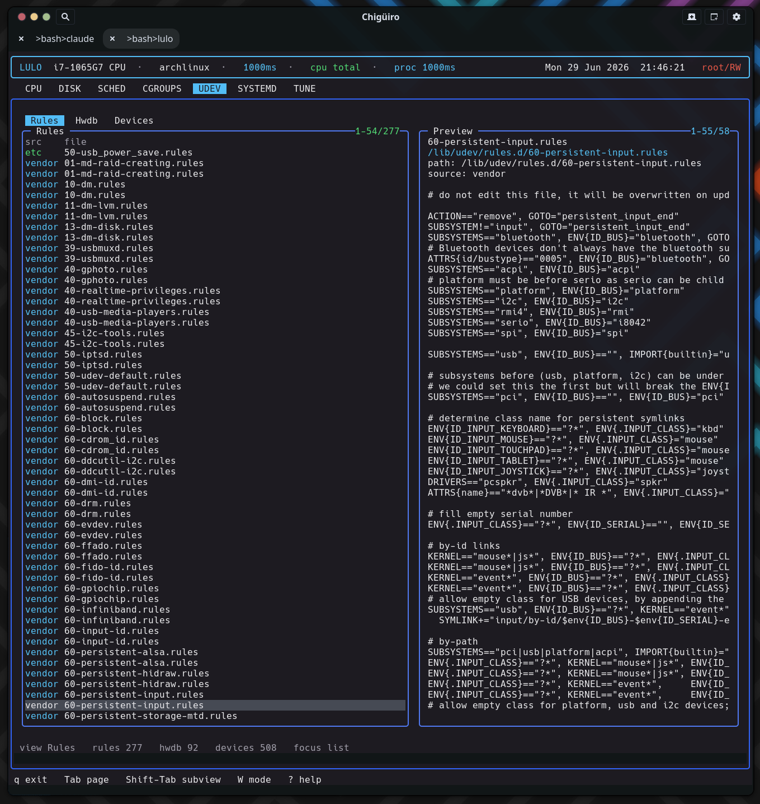

# Lulo -- Udev View

The `UDEV` page brings rule files, the hardware database, and live device records into one surface -- and it does so entirely by reading the filesystem, including the resolved device state in `/run/udev/data`, with no libudev dependency.

## Table of Contents

1. [What the page shows](#1-what-the-page-shows)
2. [Three views, three filesystem sources](#2-three-views-three-filesystem-sources)
3. [Rules and Hwdb](#3-rules-and-hwdb)
4. [Devices: reading the udev runtime database](#4-devices-reading-the-udev-runtime-database)
5. [Editing](#5-editing)
6. [See also](#6-see-also)

---

## 1. What the page shows

`UDEV` is an inspection and configuration surface for device handling. Like the cgroups, systemd, and tune pages it runs on the client/daemon split: a backend thread requests a snapshot from `lulod`, which gathers the data and caches it (see [Process Model & IPC](process-model-ipc.gen.html)).

| Subview | Purpose |
| --- | --- |
| `Rules` | Installed udev `.rules` files |
| `Hwdb` | Installed `.hwdb` hardware-database files |
| `Devices` | Live device records from udev's runtime state |

## 2. Three views, three filesystem sources

Each view is a directory scan or file parse -- there is no `udevadm` subprocess and no libudev linkage.

<svg width="100%" viewBox="0 0 980 260" xmlns="http://www.w3.org/2000/svg">
  
  <rect x="0" y="0" width="980" height="260" class="bg"/>
  <text x="490" y="26" text-anchor="middle" class="title">UDEV: filesystem-only data sources</text>

  <rect x="40"  y="56" width="270" height="48" class="view"/>
  <text x="175" y="78"  text-anchor="middle" class="lbl-blu">Rules</text>
  <text x="175" y="95"  text-anchor="middle" class="lbl-mut">.rules in rule_roots[]</text>
  <rect x="355" y="56" width="270" height="48" class="view"/>
  <text x="490" y="78"  text-anchor="middle" class="lbl-blu">Hwdb</text>
  <text x="490" y="95"  text-anchor="middle" class="lbl-mut">.hwdb in hwdb_roots[]</text>
  <rect x="670" y="56" width="270" height="48" class="view"/>
  <text x="805" y="78"  text-anchor="middle" class="lbl-blu">Devices</text>
  <text x="805" y="95"  text-anchor="middle" class="lbl-mut">/run/udev/data records</text>

  <line x1="175" y1="104" x2="175" y2="150" class="ln"/>
  <line x1="490" y1="104" x2="490" y2="150" class="ln"/>
  <line x1="805" y1="104" x2="805" y2="150" class="ln"/>

  <rect x="40"  y="152" width="270" height="44" class="src"/>
  <text x="175" y="172" text-anchor="middle" class="lbl-sm">/etc/udev/rules.d, vendor dirs</text>
  <text x="175" y="187" text-anchor="middle" class="lbl-mut">directory scan, suffix filter</text>
  <rect x="355" y="152" width="270" height="44" class="src"/>
  <text x="490" y="172" text-anchor="middle" class="lbl-sm">/etc + /usr/lib udev hwdb.d</text>
  <text x="490" y="187" text-anchor="middle" class="lbl-mut">directory scan, suffix filter</text>
  <rect x="670" y="152" width="270" height="44" class="src"/>
  <text x="805" y="172" text-anchor="middle" class="lbl-sm">resolved device DB</text>
  <text x="805" y="187" text-anchor="middle" class="lbl-mut">E:SUBSYSTEM / DEVNAME / P:syspath</text>
</svg>

## 3. Rules and Hwdb

The Rules and Hwdb views are directory listings of their respective roots, filtered by filename suffix (`.rules`, `.hwdb`). Both show a two-column list:

| Column | Meaning |
| --- | --- |
| `src` | Source: `/etc` overrides (green) vs vendor (cyan) |
| `file` | File name |

Selecting a file previews a path / source header followed by a raw dump of the file. The two views share the same preview renderer, so a hwdb file reads exactly like a rule file -- header plus contents. This makes the page a fast way to see how device naming, permissions, and properties are actually defined on this system across both vendor and local overrides.

<figure class="screenshot">
  
  <figcaption>The Rules view: installed rule files with source ranking, and the selected rule file previewed.</figcaption>
</figure>

## 4. Devices: reading the udev runtime database

The Devices view is the novel part. Instead of enumerating sysfs or calling libudev, it parses udev's own **resolved runtime database** under `/run/udev/data`. Each file there is a per-device record that udev wrote after processing rules; Lulo reads it line by line, pulling out the subsystem, device node, and syspath.

| Column | Meaning |
| --- | --- |
| `subsystem` | Device subsystem (cyan) |
| `name` | Derived from devnode, then devpath, then the record filename |
| `devnode` | Device node path |

Selecting a device previews a header (path / subsystem / devnode / syspath) followed by the raw udev-db record, sorted by subsystem then name. Reading `/run/udev/data` directly is what lets the page show the *resolved* device state -- the properties udev actually assigned -- without a libudev dependency or a sysfs crawl.

## 5. Editing

`UDEV` uses the shared external-editor handoff, the same model as `SCHED` and `SYSTEMD`. Rule and hwdb files expose an edit path; pressing `i` opens it in `$VISUAL` / `$EDITOR`, and privileged writes commit through `lulod-system`'s atomic, allowlist-scoped edit protocol. The Devices view is **not** editable -- the `/run/udev/data` records are runtime state, not user-authored config, so there is no edit path for them.

| What exists today | Not the main workflow yet |
| --- | --- |
| Browse rule and hwdb files | Rule creation / deletion as a TUI-first flow |
| Inspect live device records | High-level device action tooling |
| Edit rule and hwdb files | A full `udevadm` replacement |

## 6. See also

- [Systemd View](systemd.gen.html)
- [Cgroups View](cgroups.gen.html)
- [Tune View](tune.gen.html) -- kernel and pseudo-file tuning
- [Architecture Overview](architecture.gen.html)
